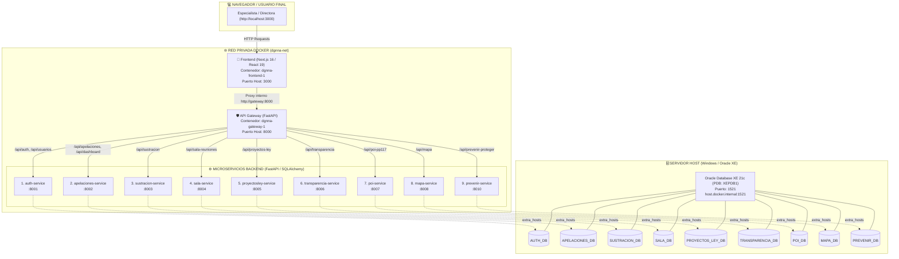

# 🐳 ARQUITECTURA DE CONTENEDORES Y DISTRIBUCIÓN DOCKER
## Sistema Integral DGNNA — Ministerio de la Mujer y Poblaciones Vulnerables (MIMP)

Este documento detalla la topología de red, la distribución de los **11 contenedores**, el flujo de comunicación interna y el mecanismo de conexión con la base de datos **Oracle XE 21c** en el sistema DGNNA.

---

## 🗺️ 1. Diagrama de Topología y Flujo de Conexión



---

## 📊 2. Tabla Maestra de Servicios y Contenedores

| # | Servicio Docker | Contenedor | Puerto Host | Puerto Interno | Esquema Oracle | Responsabilidad Principal |
| :-: | :--- | :--- | :-: | :-: | :--- | :--- |
| **1** | `frontend` | `dgnna-frontend-1` | **3000** | 3000 | — | Interfaz de Usuario Next.js 16 / React 19 (Server + Client Components) |
| **2** | `gateway` | `dgnna-gateway-1` | **8000** | 8000 | — | API Gateway Central: Validador JWT, enrutador y proxy hacia microservicios |
| **3** | `auth-service` | `dgnna-auth-service-1` | **8001** | 8001 | `AUTH_DB` | Autenticación, JWT, roles y gestión de usuarios y permisos por módulo |
| **4** | `apelaciones-service` | `dgnna-apelaciones-service-1` | **8002** | 8002 | `APELACIONES_DB` | Recursos de apelación, balance de carga de abogados, revisores y SLA |
| **5** | `sustracion-service` | `dgnna-sustracion-service-1` | **8003** | 8003 | `SUSTRACION_DB` | Convenio de La Haya 1980, fases operativas, NNA y medidas judiciales |
| **6** | `sala-service` | `dgnna-sala-service-1` | **8004** | 8004 | `SALA_DB` | Reserva y disponibilidad horaria de salas de reuniones institucionales |
| **7** | `proyectosley-service` | `dgnna-proyectosley-service-1` | **8005** | 8005 | `PROYECTOS_LEY_DB` | Iniciativas parlamentarias del Congreso, opiniones técnicas y alertas 48h |
| **8** | `transparencia-service`| `dgnna-transparencia-service-1`| **8006**| 8006 | `TRANSPARENCIA_DB`| Solicitudes ciudadanas de acceso a la información (Ley 27806) |
| **9** | `poi-service` | `dgnna-poi-service-1` | **8007** | 8007 | `POI_DB` | Ejecución física/financiera del POI y Programa Presupuestal 0117 (DGNNA vs UPE) |
| **10**| `mapa-service` | `dgnna-mapa-service-1` | **8008** | 8008 | `MAPA_DB` | Cobertura territorial y geolocalización de servicios (UPE, CAR, DEMUNA) |
| **11**| `prevenir-service` | `dgnna-prevenir-service-1` | **8010** | 8010 | `PREVENIR_DB` | Registro y seguimiento de intervenciones preventivas y de protección |

---

## 🌐 3. ¿Cómo funciona la Comunicación en Docker?

### A. Red Interna Bridge (`dgnna-net`)
* Todos los 11 contenedores conviven dentro de una misma red privada virtual llamada **`dgnna-net`**.
* **Resolución Automática de Nombres (DNS Interno):**  
  Un contenedor no necesita saber la IP de otro; utiliza directamente el nombre del servicio:
  * El Frontend se comunica con el Gateway usando: `http://gateway:8000`.
  * El Gateway se comunica con Sustracción usando: `http://sustracion-service:8003`.
  * El Gateway se comunica con Auth usando: `http://auth-service:8001`.

### B. Enrutamiento del API Gateway (`servicios/api-gateway/main.py`)
El Gateway escucha en el puerto `8000` y analiza el prefijo de cada petición entrante:

```python
ROUTE_MAP = [
    ("/api/auth",              "auth-service:8001"),
    ("/api/usuarios",          "auth-service:8001"),
    ("/api/apelaciones",       "apelaciones-service:8002"),
    ("/api/dashboard",         "apelaciones-service:8002"),
    ("/api/sustracion",        "sustracion-service:8003"),
    ("/api/sala-reuniones",    "sala-service:8004"),
    ("/api/proyectos-ley",     "proyectosley-service:8005"),
    ("/api/transparencia",     "transparencia-service:8006"),
    ("/api/poi-pp117",         "poi-service:8007"),
    ("/api/mapa",              "mapa-service:8008"),
    ("/api/prevenir-proteger", "prevenir-service:8010"),
]
```

---

## 🗄️ 4. Conexión desde Docker hacia Oracle XE (Host Windows)

Dado que la base de datos **Oracle Database XE 21c** corre nativamente en el sistema operativo Windows del Host (fuera de Docker), los contenedores se conectan mediante el túnel especial de Docker Desktop:

### 🔑 Configuración en `docker-compose.yml`:
1. **Resolución de Host:**
   ```yaml
   extra_hosts:
     - "host.docker.internal:host-gateway"
   ```
2. **Cadena de Conexión SQLAlchemy (`DATABASE_URL`):**
   ```text
   oracle+oracledb://<usuario>:<password>@host.docker.internal:1521/?service_name=XEPDB1
   ```
   * **Host:** `host.docker.internal` (apunta a la IP de la máquina Windows).
   * **Puerto:** `1521` (puerto estándar de Oracle Listener).
   * **Servicio / PDB:** `XEPDB1` (Pluggable Database oficial).

---

## 🛠️ 5. Guía de Comandos Operativos (Cheat Sheet)

### 🔹 Gestión Global del Ecosistema
```powershell
# Levantar todos los contenedores en segundo plano
docker compose up -d

# Ver el estado de todos los contenedores
docker compose ps

# Apagar todos los contenedores sin borrar datos
docker compose down
```

---

### 🔹 Reiniciar o Reconstruir un Módulo Específico (Sin detener a los demás)

| Acción | Comando PowerShell |
| :--- | :--- |
| **Reiniciar Frontend** | `docker compose restart frontend` |
| **Reconstruir Frontend** | `docker compose up -d --build frontend` |
| **Reiniciar Auth Service** | `docker compose restart auth-service` |
| **Reiniciar Sustracción** | `docker compose restart sustracion-service` |
| **Reiniciar Apelaciones** | `docker compose restart apelaciones-service` |
| **Reiniciar Prevenir** | `docker compose restart prevenir-service` |
| **Reiniciar API Gateway** | `docker compose restart gateway` |

---

### 🔹 Ver Logs en Tiempo Real
```powershell
# Ver logs de un servicio específico (ej. Sustracción)
docker compose logs -f sustracion-service

# Ver logs del API Gateway
docker compose logs -f gateway

# Ver las últimas 50 líneas del Frontend
docker compose logs --tail 50 frontend
```
*(Para salir de los logs presiona `Ctrl + C`).*

---

### 🔹 Verificación de Salud del Ecosistema
Puedes abrir en tu navegador o probar con PowerShell:
* **Estado de todos los microservicios:** [http://localhost:8000/health](http://localhost:8000/health)
* **Documentación interactiva Swagger del Gateway:** [http://localhost:8000/docs](http://localhost:8000/docs)
* **Aplicación Web Principal:** [http://localhost:3000](http://localhost:3000)
