# 🐳 ARQUITECTURA DE CONTENEDORES Y DISTRIBUCIÓN DOCKER
## Sistema Integral DGNNA — Ministerio de la Mujer y Poblaciones Vulnerables (MIMP)

Este documento detalla la topología de red, la distribución de los **13 contenedores**, el flujo de comunicación interna, los hooks de auditoría en segundo plano, el motor RAG de consulta normativa y el mecanismo de conexión con la base de datos **Oracle XE 21c** en el sistema DGNNA.

---

## 🗺️ 1. Diagrama de Topología y Flujo de Conexión

```mermaid
flowchart TD
    subgraph HostClient["💻 NAVEGADOR / USUARIO FINAL"]
        User["Especialista / Directora (http://localhost:3000 o http://IP:3000)"]
    end

    subgraph DockerBridge["🌐 RED PRIVADA DOCKER (dgnna-net)"]
        Frontend["🎨 Frontend (Next.js 16 / React 19)\nContenedor: dgnna-frontend-1\nPuerto Host: 3000"]
        Gateway["🛡️ API Gateway (FastAPI)\nContenedor: dgnna-gateway-1\nPuerto Host: 8000"]

        subgraph Microservicios["⚙️ MICROSERVICIOS BACKEND (FastAPI / SQLAlchemy)"]
            S_Auth["1. auth-service\n:8001"]
            S_Apel["2. apelaciones-service\n:8002"]
            S_Sust["3. sustracion-service\n:8003"]
            S_Sala["4. sala-service\n:8004"]
            S_Pley["5. proyectosley-service\n:8005"]
            S_Trans["6. transparencia-service\n:8006"]
            S_Poi["7. poi-service\n:8007"]
            S_Mapa["8. mapa-service\n:8008"]
            S_Prev["9. prevenir-service\n:8010"]
            S_Audit["10. auditoria-service\n:8009"]
            S_Norm["11. normativa-service\n:8011 (RAG Multi-LLM)"]
        end
    end

    subgraph HostDatabase["🗄️ SERVIDOR HOST (Windows / Oracle XE / SQLite Fallback)"]
        Oracle["Oracle Database XE 21c (PDB: XEPDB1)\nPuerto: 1521\nhost.docker.internal:1521"]
        
        DB_Auth[("AUTH_DB")]
        DB_Apel[("APELACIONES_DB")]
        DB_Sust[("SUSTRACION_DB")]
        DB_Sala[("SALA_DB")]
        DB_Pley[("PROYECTOS_LEY_DB")]
        DB_Trans[("TRANSPARENCIA_DB")]
        DB_Poi[("POI_DB")]
        DB_Mapa[("MAPA_DB")]
        DB_Prev[("PREVENIR_DB")]
        DB_Audit[("AUDITORIA_DB")]
        DB_Norm[("NORMATIVA_DB")]
    end

    User -->|HTTP Requests| Frontend
    Frontend -->|Proxy interno http://gateway:8000| Gateway

    Gateway -->|/api/auth, /api/usuarios| S_Auth
    Gateway -->|/api/apelaciones, /api/dashboard| S_Apel
    Gateway -->|/api/sustracion| S_Sust
    Gateway -->|/api/sala-reuniones| S_Sala
    Gateway -->|/api/proyectos-ley| S_Pley
    Gateway -->|/api/transparencia| S_Trans
    Gateway -->|/api/poi-pp117| S_Poi
    Gateway -->|/api/mapa| S_Mapa
    Gateway -->|/api/prevenir-proteger| S_Prev
    Gateway -->|/api/auditoria| S_Audit
    Gateway -->|/api/normativa| S_Norm

    %% Hooks de auditoría en segundo plano
    S_Sust -.->|Auditoría Async POST| S_Audit
    S_Apel -.->|Auditoría Async POST| S_Audit
    S_Pley -.->|Auditoría Async POST| S_Audit
    S_Trans -.->|Auditoría Async POST| S_Audit
    S_Norm -.->|Auditoría Async POST| S_Audit

    S_Auth -.->|extra_hosts| DB_Auth
    S_Apel -.->|extra_hosts| DB_Apel
    S_Sust -.->|extra_hosts| DB_Sust
    S_Sala -.->|extra_hosts| DB_Sala
    S_Pley -.->|extra_hosts| DB_Pley
    S_Trans -.->|extra_hosts| DB_Trans
    S_Poi -.->|extra_hosts| DB_Poi
    S_Mapa -.->|extra_hosts| DB_Mapa
    S_Prev -.->|extra_hosts| DB_Prev
    S_Audit -.->|extra_hosts| DB_Audit
    S_Norm -.->|extra_hosts| DB_Norm

    Oracle --- DB_Auth
    Oracle --- DB_Apel
    Oracle --- DB_Sust
    Oracle --- DB_Sala
    Oracle --- DB_Pley
    Oracle --- DB_Trans
    Oracle --- DB_Poi
    Oracle --- DB_Mapa
    Oracle --- DB_Prev
    Oracle --- DB_Audit
    Oracle --- DB_Norm
```



---

## 📊 2. Tabla Maestra de Servicios y Contenedores

| # | Servicio Docker | Contenedor | Puerto Host | Puerto Interno | Esquema / Almacén | Responsabilidad Principal |
| :-: | :--- | :--- | :-: | :-: | :--- | :--- |
| **1** | `frontend` | `dgnna-frontend-1` | **3000** | 3000 | — | Interfaz Next.js 16 / React 19 con Server Components y proxy dinámico |
| **2** | `gateway` | `dgnna-gateway-1` | **8000** | 8000 | — | API Gateway Central: Validador JWT, enrutador y balanceador de microservicios |
| **3** | `auth-service` | `dgnna-auth-service-1` | **8001** | 8001 | `AUTH_DB` | Autenticación, JWT, roles y gestión de usuarios y permisos por módulo |
| **4** | `apelaciones-service` | `dgnna-apelaciones-service-1` | **8002** | 8002 | `APELACIONES_DB` | Expedientes de apelación, asignación de revisores y generación de resoluciones |
| **5** | `sustracion-service` | `dgnna-sustracion-service-1` | **8003** | 8003 | `SUSTRACION_DB` | Casos de restitución internacional de NNA (Convenio de La Haya 1980) |
| **6** | `sala-service` | `dgnna-sala-service-1` | **8004** | 8004 | `SALA_DB` | Reserva y control de la sala de reuniones de DGNNA |
| **7** | `proyectosley-service` | `dgnna-proyectosley-service-1` | **8005** | 8005 | `PROYECTOS_LEY_DB` | Opiniones técnicas y seguimiento de proyectos de ley |
| **8** | `transparencia-service` | `dgnna-transparencia-service-1` | **8006** | 8006 | `TRANSPARENCIA_DB` | Solicitudes de acceso a la información pública (SAIP) y plazos legales |
| **9** | `poi-service` | `dgnna-poi-service-1` | **8007** | 8007 | `POI_DB` | Carga masiva y seguimiento de ejecución del POI y Programa Presupuestal 0117 |
| **10** | `mapa-service` | `dgnna-mapa-service-1` | **8008** | 8008 | `MAPA_DB` | Cobertura territorial y geo-referenciación de UPE, CAR, DEMUNA a nivel nacional |
| **11** | `auditoria-service` | `auditoria-service-1` | **8009** | 8009 | `AUDITORIA_DB` | Registro inmutable de actividades, trazabilidad y visor forense |
| **12** | `prevenir-service` | `dgnna-prevenir-service-1` | **8010** | 8010 | `PREVENIR_DB` | Servicios de prevención y protección a nivel distrital y regional |
| **13** | `normativa-service` | `normativa-service-1` | **8011** | 8011 | `NORMATIVA_DB` | Consulta normativa y Asistente RAG Multi-LLM (ChatGPT, Gemini, Claude) anclado al DL 1297 y Reglamento |

---

## 🌐 3. ¿Cómo funciona la Comunicación en Docker?

### A. Red Interna Bridge (`dgnna-net`)
* Todos los 12 contenedores conviven dentro de una misma red privada virtual llamada **`dgnna-net`**.
* **Resolución Automática de Nombres (DNS Interno):**  
  Un contenedor no necesita saber la IP de otro; utiliza directamente el nombre del servicio:
  * El Frontend se comunica con el Gateway usando: `http://gateway:8000`.
  * El Gateway se comunica con Sustracción usando: `http://sustracion-service:8003`.
  * El Gateway se comunica con Auditoría usando: `http://auditoria-service:8009`.
  * Los microservicios despachan eventos a Auditoría usando: `http://auditoria-service:8009/api/auditoria`.

### B. Enrutamiento del API Gateway (`servicios/api-gateway/main.py`)
El Gateway escucha en el puerto `8000` y analiza el prefijo de cada petición entrante:

```python
ROUTE_MAP = [
    ("/api/auth",              "auth-service:8001"),
    ("/api/usuarios",          "auth-service:8001"),
    ("/api/apelaciones",       "apelaciones-service:8002"),
    ("/api/dashboard",         "apelaciones-service:8002"),
    ("/api/sustracion",        "sustracion-service:8003"),
    ("/api/sala-reuniones",    "sala-service:8004"),
    ("/api/proyectos-ley",     "proyectosley-service:8005"),
    ("/api/transparencia",     "transparencia-service:8006"),
    ("/api/poi-pp117",         "poi-service:8007"),
    ("/api/mapa",              "mapa-service:8008"),
    ("/api/auditoria",         "auditoria-service:8009"),
    ("/api/prevenir-proteger", "prevenir-service:8010"),
]
```

---

## 🗄️ 4. Conexión desde Docker hacia Oracle XE (Host Windows)

Dado que la base de datos **Oracle Database XE 21c** corre nativamente en el sistema operativo Windows del Host (fuera de Docker), los contenedores se conectan mediante el túnel especial de Docker Desktop:

### 🔑 Configuración en `docker-compose.yml`:
1. **Resolución de Host:**
   ```yaml
   extra_hosts:
     - "host.docker.internal:host-gateway"
   ```
2. **Cadena de Conexión SQLAlchemy (`DATABASE_URL`):**
   ```text
   oracle+oracledb://<usuario>:<password>@host.docker.internal:1521/?service_name=XEPDB1
   ```
   * **Host:** `host.docker.internal` (apunta a la IP de la máquina Windows).
   * **Puerto:** `1521` (puerto estándar de Oracle Listener).
   * **Servicio / PDB:** `XEPDB1` (Pluggable Database oficial).

---

## 🛠️ 5. Guía de Comandos Operativos (Cheat Sheet)

### 🔹 Gestión Global del Ecosistema
```powershell
# Levantar todos los 12 contenedores en segundo plano
docker compose up -d

# Ver el estado de todos los contenedores
docker compose ps

# Apagar todos los contenedores sin borrar datos
docker compose down
```

---

### 🔹 Reiniciar o Reconstruir un Módulo Específico (Sin detener a los demás)

| Acción | Comando PowerShell |
| :--- | :--- |
| **Reiniciar Frontend** | `docker compose restart frontend` |
| **Reconstruir Frontend** | `docker compose up -d --build frontend` |
| **Reiniciar Auditoría** | `docker compose restart auditoria-service` |
| **Reconstruir Auditoría** | `docker compose up -d --build auditoria-service` |
| **Reiniciar Auth Service** | `docker compose restart auth-service` |
| **Reiniciar Sustracción** | `docker compose restart sustracion-service` |
| **Reiniciar Apelaciones** | `docker compose restart apelaciones-service` |
| **Reiniciar Prevenir** | `docker compose restart prevenir-service` |
| **Reiniciar API Gateway** | `docker compose restart gateway` |

---

### 🔹 Ver Logs en Tiempo Real
```powershell
# Ver logs de auditoría
docker compose logs -f auditoria-service

# Ver logs de sustracción
docker compose logs -f sustracion-service

# Ver logs del API Gateway
docker compose logs -f gateway

# Ver las últimas 50 líneas del Frontend
docker compose logs --tail 50 frontend
```
*(Para salir de los logs presiona `Ctrl + C`).*

---

### 🔹 Verificación de Salud del Ecosistema
Puedes abrir en tu navegador o probar con PowerShell:
* **Estado de todos los microservicios:** [http://localhost:8000/health](http://localhost:8000/health)
* **Documentación interactiva Swagger del Gateway:** [http://localhost:8000/docs](http://localhost:8000/docs)
* **Módulo de Auditoría y Trazabilidad:** [http://localhost:3000/auditoria](http://localhost:3000/auditoria)
* **Aplicación Web Principal:** [http://localhost:3000](http://localhost:3000)
