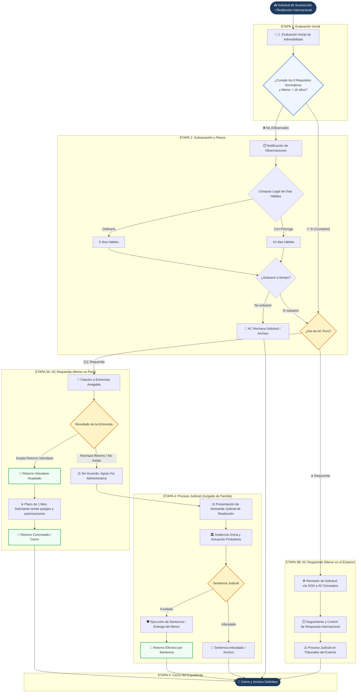

# Diagrama de Flujo Operativo — Sustracción Internacional de Menores
### Directiva N.° 006-2021-MIMP / DGNNA

Este documento describe el flujo procedimental completo de atención a solicitudes de restitución y régimen de visitas internacional, integrando las 4 etapas operativas de la Autoridad Central peruana.

---

## 1. Diagrama de Flujo del Proceso (Mermaid)

---

## 2. Descripción de las 4 Sub-Etapas Guiadas

### Etapa 1: Evaluación Inicial de Admisibilidad
* **Matriz de 8 Requisitos Normativos:**
  1. Solicitud formal de restitución o régimen de visitas identificada.
  2. Identidad y datos del menor (verificación automática de menor de 16 años).
  3. Residencia habitual acreditada en el Estado requirente.
  4. Derecho de custodia o visitas legalmente ejercido.
  5. Traslado o retención ilícita identificado.
  6. Documentación sustentatoria y partidas de nacimiento completas.
  7. Traducciones oficiales al español (cuando corresponda).
  8. Información para ubicación del menor y del presunto sustractor.
* **Dictamen:** Si los 8 están conformes ➔ Pasa a Retorno/Cooperación. Si hay observaciones ➔ Pasa a Subsanación.

### Etapa 2: Subsanación y Control de Plazos
* **Cómputo legal automático:** 
  * Plazo ordinario: **5 días hábiles** a partir de la notificación.
  * Prórroga justificada: **10 días hábiles**.
  * Se omiten automáticamente sábados, domingos y feriados.

### Etapa 3: Retorno Voluntario / Cooperación Internacional
* **Si Perú es Autoridad Requerida (Menor en Perú):**
  * Citación a entrevista amigable con el progenitor que retiene al menor.
  * **Acepta retorno:** Se concede **1 mes** a la parte solicitante para remitir pasajes y autorizaciones de viaje. Se bloquea la vía judicial.
  * **Rechaza retorno / Inasistencia:** Se agota la vía administrativa y se pasa inmediatamente a la vía judicial.
* **Si Perú es Autoridad Requirente (Menor en el Exterior):**
  * Emisión y control de oficios SGD dirigidos a la Autoridad Central Extranjera.
  * Monitoreo de plazos de respuesta internacional y cooperación consular.

### Etapa 4: Proceso Judicial (Juzgado de Familia)
* Presentación de demanda ante el Poder Judicial (Juzgado de Familia competente).
* Registro y seguimiento de:
  * Número de expediente judicial.
  * Juzgado competente.
  * Sentencia de 1ra Instancia.
  * Sentencia de 2da Instancia / Vista de la causa.
  * Recurso de Casación.
  * Medidas cautelares y ejecución del retorno forzoso.

---

## 3. Motivos de Cierre y Archivo Definitivo
1. Retorno voluntario concretado.
2. Retorno por ejecución de sentencia judicial.
3. Acuerdo extrajudicial entre las partes.
4. Sentencia judicial infundada.
5. AC rechaza solicitud (Violencia familiar / Art. 12 / Art. 13 / Art. 27 del Convenio).
6. Transcurso de plazo sin ubicar al menor.
7. Desistimiento expreso de la parte solicitante.
