# DOCUMENTO DE ARQUITECTURA DE SOFTWARE

## Sistema Integral DGNNA

**Dirección General de Niñas, Niños y Adolescentes**
**Ministerio de la Mujer y Poblaciones Vulnerables — MIMP**

---

### Control del documento

| Campo | Contenido |
| :--- | :--- |
| **Título** | Documento de Arquitectura de Software — Sistema Integral DGNNA |
| **Código** | DAS-DGNNA-001 |
| **Versión** | 1.0 |
| **Fecha de emisión** | *(a completar)* |
| **Elaborado por** | Dirección General de Niñas, Niños y Adolescentes (DGNNA) |
| **Dirigido a** | Oficina General de Tecnologías de la Información (OGTI) |
| **Documento relacionado** | MD-DGNNA-001 — Manual de Despliegue |
| **Clasificación** | Uso interno — MIMP |

### Historial de versiones

| Versión | Fecha | Autor | Descripción del cambio |
| :---: | :--- | :--- | :--- |
| 1.0 | *(a completar)* | DGNNA | Versión inicial. |

### Aprobaciones

| Rol | Nombre | Cargo | Firma | Fecha |
| :--- | :--- | :--- | :--- | :--- |
| Elabora | | | | |
| Revisa | | | | |
| Aprueba | | | | |

---

## Tabla de contenido

1. [Introducción](#1-introducción)
2. [Contexto del sistema](#2-contexto-del-sistema)
3. [Vista de contenedores](#3-vista-de-contenedores)
4. [Vista de componentes](#4-vista-de-componentes)
5. [Vista de datos](#5-vista-de-datos)
6. [Vistas dinámicas](#6-vistas-dinámicas)
7. [Seguridad de la arquitectura](#7-seguridad-de-la-arquitectura)
8. [Vista de despliegue](#8-vista-de-despliegue)
9. [Decisiones de arquitectura](#9-decisiones-de-arquitectura)
10. [Requisitos no funcionales](#10-requisitos-no-funcionales)
11. [Deuda técnica identificada](#11-deuda-técnica-identificada)
12. [Evolución prevista](#12-evolución-prevista)
13. [Glosario](#13-glosario)

---

## 1. Introducción

### 1.1. Propósito

Describir la arquitectura del Sistema Integral DGNNA con el nivel de detalle necesario para que la OGTI pueda evaluar su sostenibilidad técnica, dimensionar la infraestructura requerida y asumir su operación y mantenimiento.

### 1.2. Alcance

El documento cubre la estructura estática del sistema (contenedores, componentes y datos), su comportamiento dinámico en los escenarios principales, las decisiones arquitectónicas adoptadas con su justificación, los requisitos no funcionales y la deuda técnica reconocida.

### 1.3. Notación

Se emplea una adaptación del modelo **C4** (contexto, contenedores, componentes) complementada con diagramas de secuencia, expresados en notación Mermaid. Todo el contenido de este documento se deriva del código fuente del sistema y del catálogo de tablas verificado contra la base de datos.

### 1.4. Documentos de referencia

| Documento | Contenido |
| :--- | :--- |
| MD-DGNNA-001 | Manual de Despliegue |
| `ARQUITECTURA_DOCKER.md` | Topología de contenedores del repositorio |
| `tablas.md` | Catálogo de tablas verificado contra Oracle |
| `docs/AUDITORIA_GESTION_USUARIOS.md` | Auditoría del subsistema de usuarios y autenticación |
| `docs/MODULO_CONSULTA_NORMATIVA.md` | Diseño del módulo de consulta normativa y RAG |

---

## 2. Contexto del sistema

### 2.1. Diagrama de contexto

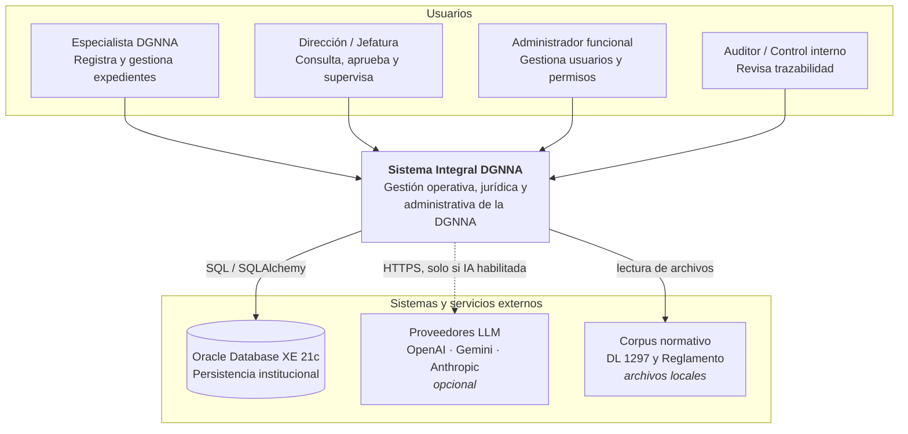

### 2.2. Actores

| Actor | Descripción | Interacción principal |
| :--- | :--- | :--- |
| Especialista DGNNA | Personal operativo de las direcciones de línea. | Registra expedientes, actualiza estados, consulta normativa. |
| Dirección / Jefatura | Nivel directivo. | Consulta tableros, valida asignaciones, supervisa plazos. |
| Administrador funcional | Responsable de la gestión de accesos. | Crea usuarios y asigna permisos por módulo. |
| Auditor / Control interno | Revisión y control. | Consulta el registro de trazabilidad y genera reportes. |

### 2.3. Dependencias externas

| Dependencia | Criticidad | Efecto de su indisponibilidad |
| :--- | :--- | :--- |
| Oracle Database XE 21c | **Crítica** | El sistema deja de operar; los microservicios no arrancan o responden con error. |
| Proveedores LLM | Baja | El asistente normativo con IA deja de responder; la búsqueda determinista del módulo sigue operativa. |
| Corpus normativo local | Media | El módulo de consulta normativa no puede sembrar ni actualizar su corpus. |

---

## 3. Vista de contenedores

### 3.1. Diagrama de contenedores

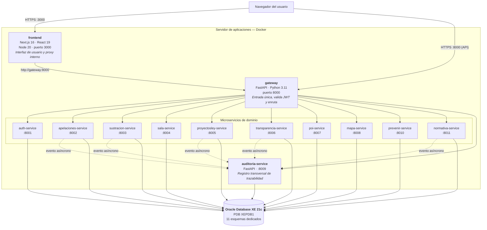

### 3.2. Descripción de contenedores

| Contenedor | Tecnología | Responsabilidad | Estado |
| :--- | :--- | :--- | :--- |
| `frontend` | Next.js 16 (App Router), React 19, Tailwind CSS 4 | Presenta la interfaz de todos los módulos, gestiona la sesión del navegador y actúa como proxy hacia el Gateway en las llamadas del lado del servidor. | Productivo |
| `gateway` | FastAPI 0.111, `httpx`, `PyJWT` | Punto de entrada único. Valida el token JWT, resuelve el microservicio destino por prefijo de ruta y reenvía la petición preservando método, cabeceras y cuerpo. | Productivo |
| `auth-service` | FastAPI, SQLAlchemy, `bcrypt`, `PyJWT` | Autenticación, emisión de tokens, gestión de usuarios y de permisos por módulo. | Productivo |
| `apelaciones-service` | FastAPI, SQLAlchemy, `pandas` | Expedientes de apelación, puntuación ponderada, asignación de revisores, tableros y reportes. | Productivo |
| `sustracion-service` | FastAPI, SQLAlchemy | Casos de restitución internacional bajo el Convenio de La Haya 1980 y la Directiva 006-2021-MIMP. | Productivo |
| `sala-service` | FastAPI, SQLAlchemy | Reservas y disponibilidad de la sala de reuniones. | Productivo |
| `proyectosley-service` | FastAPI, SQLAlchemy | Seguimiento de proyectos de ley, eventos y opiniones técnicas. | Productivo |
| `transparencia-service` | FastAPI, SQLAlchemy | Solicitudes de acceso a la información pública y control de plazos (Ley 27806). | Productivo |
| `poi-service` | FastAPI, SQLAlchemy, `openpyxl` | Carga masiva desde Excel y seguimiento de la ejecución del POI y del PP 0117. | Productivo |
| `mapa-service` | FastAPI, SQLAlchemy | Catálogo territorial y georreferenciación de servicios (UPE, CAR, DEMUNA). | Productivo |
| `prevenir-service` | FastAPI, SQLAlchemy | Registro de actividades de la estrategia Prevenir para Proteger. | Productivo |
| `auditoria-service` | FastAPI, SQLAlchemy | Recibe y almacena los eventos de trazabilidad emitidos por los demás servicios; expone el visor y los reportes. | Productivo |
| `normativa-service` | FastAPI, SQLAlchemy, NumPy, `pypdf`, SDK de OpenAI / Anthropic / Google | Búsqueda determinista sobre el corpus normativo y asistente RAG Multi-LLM opcional. | Productivo |

### 3.3. Patrón común de los microservicios

Todos los microservicios de dominio comparten la misma estructura interna, lo que reduce la carga cognitiva de mantenimiento:

```
servicio-<nombre>/
├── Dockerfile              # python:3.11-slim, arranque con uvicorn
├── requirements.txt        # dependencias fijadas por versión
├── main.py                 # crea la app FastAPI, monta routers y expone /health
├── domain/                 # entidades y reglas de negocio, sin dependencias de infraestructura
└── infrastructure/
    ├── db/
    │   ├── database.py     # engine SQLAlchemy, SessionLocal, Base
    │   └── models.py       # modelos ORM del esquema propio
    └── api/
        └── router_*.py     # endpoints HTTP
```

Esta organización sigue una **arquitectura hexagonal simplificada**: la capa `domain` concentra las reglas del negocio y la capa `infrastructure` agrupa lo intercambiable (persistencia y transporte HTTP).

### 3.4. Contrato común de los servicios

Todo microservicio expone, como mínimo:

| Endpoint | Método | Respuesta |
| :--- | :---: | :--- |
| `/health` | GET | `{"status": "ok", "servicio": "<nombre>"}` |
| `/` | GET | Identificación del servicio y su versión |

El Gateway consulta `/health` de los once servicios para construir la respuesta consolidada de su propio `/health`, que constituye el punto de monitoreo del sistema.

---

## 4. Vista de componentes

### 4.1. API Gateway

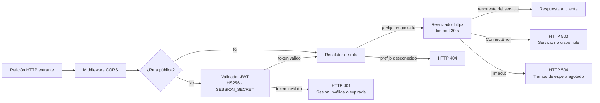

| Componente | Responsabilidad |
| :--- | :--- |
| Middleware CORS | Controla los orígenes admitidos para peticiones del navegador. |
| Filtro de rutas públicas | Exime de autenticación a `/`, `/health`, `/docs`, `/openapi.json`, `/api/auth/login` y `/api/auth/logout`. |
| Validador JWT | Decodifica y verifica la firma HS256 del token con `SESSION_SECRET`. Solo comprueba validez; no evalúa roles ni permisos. |
| Resolutor de ruta | Recorre el mapa de prefijos y devuelve la URL interna del microservicio destino. |
| Reenviador | Retransmite método, cabeceras, parámetros y cuerpo mediante `httpx`, con un tiempo de espera de 30 segundos, y traduce los fallos de transporte a códigos HTTP. |

> **Observación arquitectónica.** El Gateway verifica la *validez* del token, no la *autorización*. La decisión sobre qué puede hacer cada usuario recae en cada microservicio de dominio. Esta separación es correcta en el modelo, pero exige que los microservicios no sean alcanzables directamente desde la red (ver sección 7.3).

### 4.2. Servicio de autenticación

| Componente | Responsabilidad |
| :--- | :--- |
| `router_auth` | Inicio y cierre de sesión, emisión del token JWT. |
| `router_usuarios` | Alta, baja, modificación y consulta de usuarios. |
| Gestor de contraseñas | Derivación y verificación con `bcrypt`. |
| Modelo `USUARIOS` | Cuenta, credencial, rol global y estado. |
| Modelo `USUARIO_MODULOS` | Permiso y nivel asignado por usuario y módulo. |

El modelo de autorización es de **doble nivel**: un rol global en `USUARIOS` y un permiso específico por módulo en `USUARIO_MODULOS`.

### 4.3. Servicio de consulta normativa

Es el componente de mayor complejidad interna y el único con dependencias externas de red.

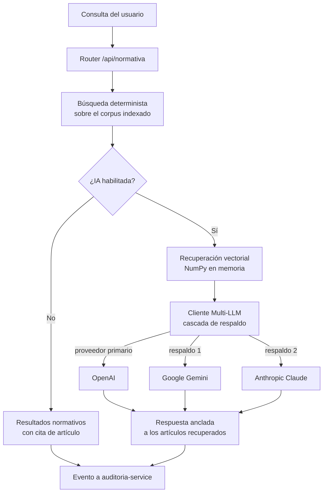

Características relevantes:

- La búsqueda determinista **no depende de ningún proveedor externo**; el módulo es funcional aunque la IA esté deshabilitada o sin conectividad.
- La recuperación vectorial se realiza **en memoria con NumPy**, sin base de datos vectorial adicional. Esto elimina un componente de infraestructura a costa de limitar el tamaño del corpus manejable.
- El corpus normativo se monta como volumen de **solo lectura** (`./normativa:/app/normativa:ro`), lo que impide que el contenedor altere los documentos fuente.
- El servicio siembra su corpus inicial al arrancar y tolera el fallo de esa siembra sin abortar el arranque.

### 4.4. Servicio de auditoría

Recibe eventos por HTTP desde los demás microservicios. La emisión es **asíncrona y no bloqueante**: si el servicio de auditoría no está disponible, la operación de negocio del servicio emisor no se interrumpe.

| Aspecto | Implicancia |
| :--- | :--- |
| Ventaja | Un fallo del registro de trazabilidad no detiene la operación institucional. |
| Riesgo | Un evento puede perderse si el servicio de auditoría está caído en ese instante. |
| Mitigación recomendada | Incorporar reintento con persistencia local en el emisor, o una cola intermedia, si el marco de control interno exige garantía de registro completo. |

---

## 5. Vista de datos

### 5.1. Principio de aislamiento

Cada microservicio es propietario exclusivo de su esquema Oracle. **Ningún servicio consulta el esquema de otro.** Las relaciones entre dominios se resuelven por identificador y mediante llamadas HTTP, no mediante `JOIN` entre esquemas.

Esta decisión es la que permite desplegar, actualizar y revertir cada módulo de forma independiente.

### 5.2. Distribución de esquemas

Estado verificado contra `USER_TABLES` de Oracle al 28 de agosto de 2026: **35 tablas físicas en 9 esquemas funcionales**.

| Esquema | Servicio propietario | Tablas | Entidad principal |
| :--- | :--- | :---: | :--- |
| `AUTH_DB` | `auth-service` | 2 | `USUARIOS` |
| `APELACIONES_DB` | `apelaciones-service` | 10 | `APELACIONES` (26 columnas) |
| `SUSTRACION_DB` | `sustracion-service` | 6 | `CASOS_SUSTRACION` (40 columnas) |
| `SALA_DB` | `sala-service` | 1 | `RESERVAS_SALA` |
| `PROYECTOS_LEY_DB` | `proyectosley-service` | 9 | `PROYECTOS_LEY` |
| `TRANSPARENCIA_DB` | `transparencia-service` | 1 | `TRANSPARENCIA` |
| `POI_DB` | `poi-service` | 2 | `POI_CARGAS` |
| `MAPA_DB` | `mapa-service` | 3 | `MAPA_INSTITUCIONES` |
| `PREVENIR_DB` | `prevenir-service` | 1 | `ACTIVIDADES_PREVENIR` |
| `AUDITORIA_DB` | `auditoria-service` | *(en operación)* | Registro de eventos |
| `NORMATIVA_DB` | `normativa-service` | *(en operación)* | Corpus normativo indexado |

### 5.3. Modelo de datos — Autenticación

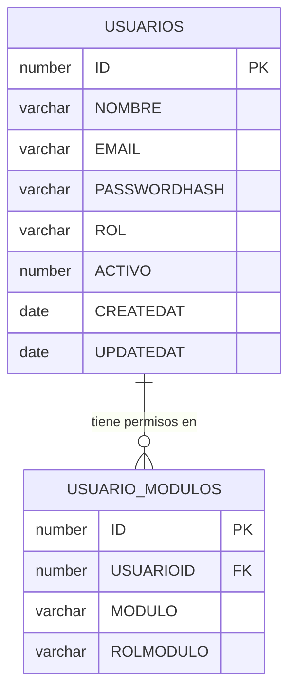

### 5.4. Modelo de datos — Apelaciones

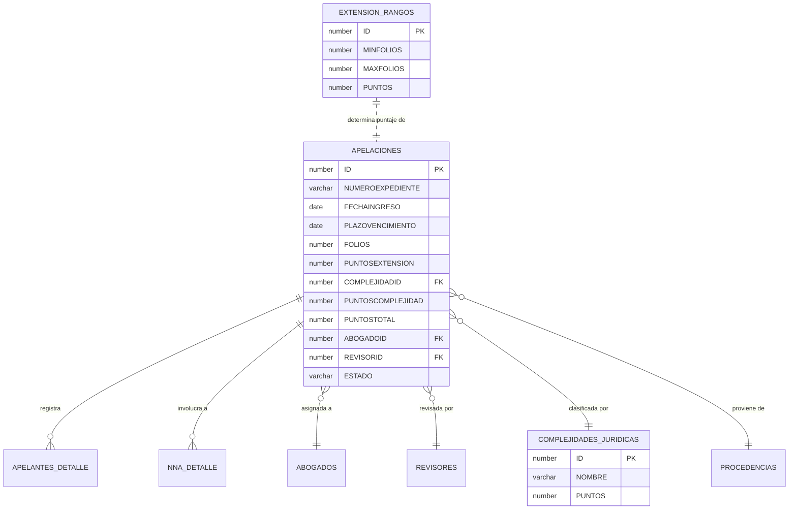

El campo `PUNTOSTOTAL` materializa el resultado del algoritmo de asignación ponderada: la suma de los puntos por extensión (derivados del número de folios según `EXTENSION_RANGOS`) y de los puntos por complejidad jurídica. Es la base del balanceo de carga entre revisores.

### 5.5. Modelo de datos — Sustracción internacional

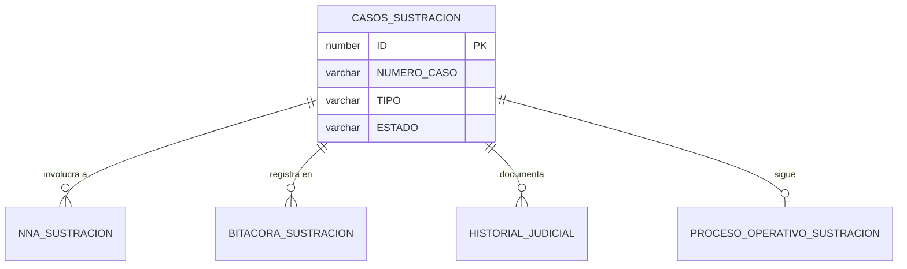

### 5.6. Estrategia de esquema y versionado

Las tablas se crean mediante `Base.metadata.create_all()` durante el arranque de cada microservicio.

| Característica | Consecuencia |
| :--- | :--- |
| Crea las tablas que no existen | Simplifica la primera instalación: no se requiere un script DDL manual. |
| **No** modifica tablas existentes | Un cambio de columna en el modelo ORM **no** se propaga a la base de datos. |
| **No** deja registro de versión de esquema | No existe trazabilidad de qué versión de estructura está desplegada. |

> **Riesgo reconocido.** Este mecanismo es adecuado para la instalación inicial pero insuficiente para la evolución del sistema en producción. La incorporación de una herramienta de migraciones versionadas (Alembic, del mismo ecosistema SQLAlchemy) se recomienda como acción de mediano plazo. Ver sección 11.

### 5.7. Estrategia de respaldo y contingencia

El `normativa-service` implementa un **respaldo automático a SQLite** cuando no logra conectar con Oracle: verifica la conexión al arrancar y, si falla, opera con una base local.

| Ventaja | Riesgo |
| :--- | :--- |
| El módulo sigue disponible ante una caída de la base de datos. | El servicio arranca en estado degradado **sin señal visible**: `/health` responde `ok` aunque no esté usando el esquema institucional. |

**Recomendación:** exponer el motor de base de datos efectivamente en uso dentro de la respuesta de `/health`, de modo que el monitoreo detecte la operación en modo degradado.

---

## 6. Vistas dinámicas

### 6.1. Inicio de sesión

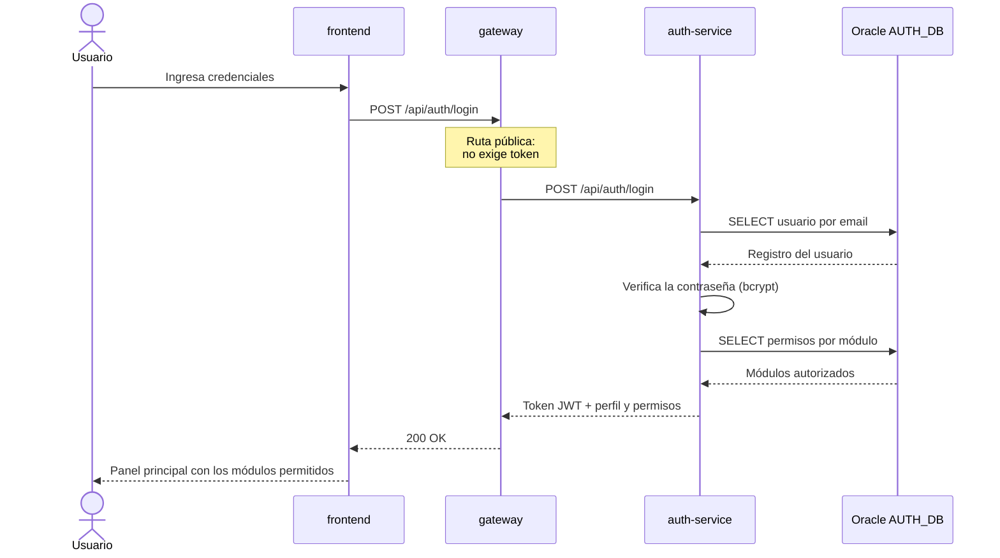

### 6.2. Operación de negocio autenticada

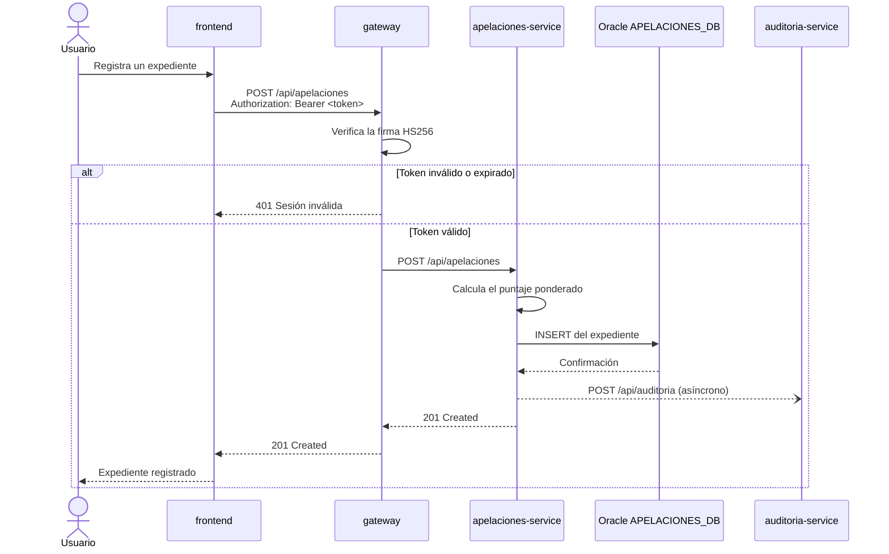

### 6.3. Degradación ante la caída de un microservicio

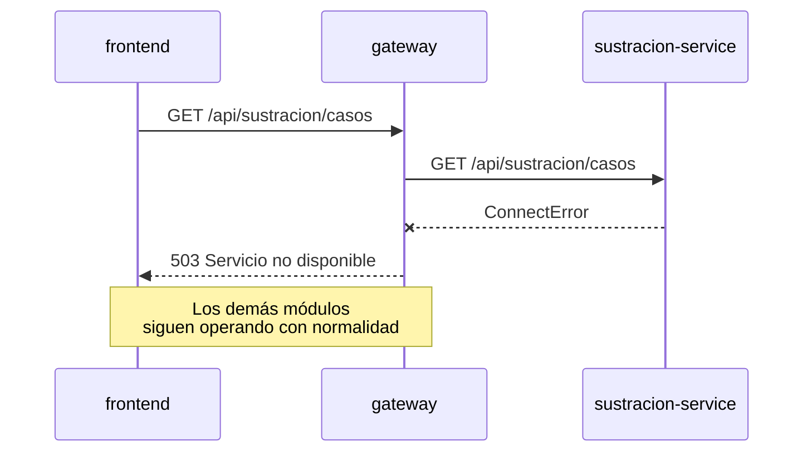

Esta es una propiedad deliberada de la arquitectura: **el fallo de un módulo no propaga la indisponibilidad al resto del sistema.**

---

## 7. Seguridad de la arquitectura

### 7.1. Modelo de autenticación

| Aspecto | Implementación |
| :--- | :--- |
| Mecanismo | Token JWT firmado con HMAC-SHA256 |
| Clave de firma | `SESSION_SECRET`, compartida entre el Gateway y los servicios |
| Transporte | Cabecera `Authorization: Bearer <token>` |
| Almacenamiento de contraseñas | Hash `bcrypt` con sal por registro |
| Punto de validación | API Gateway, en toda ruta no declarada pública |

### 7.2. Modelo de autorización

La autorización opera en dos niveles: un **rol global** en `USUARIOS` y un **permiso por módulo** en `USUARIO_MODULOS`. El Gateway no evalúa ninguno de los dos; la decisión corresponde a cada microservicio de dominio.

> La auditoría del subsistema de usuarios (`docs/AUDITORIA_GESTION_USUARIOS.md`) identificó inconsistencias en la aplicación de este modelo entre módulos. Su regularización se consigna en la sección 11 como deuda técnica prioritaria.

### 7.3. Superficie de exposición

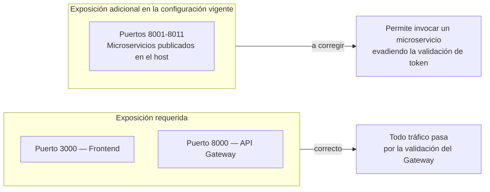

Los microservicios no validan el token por sí mismos, por lo que la publicación de sus puertos en el host constituye un camino alterno de acceso. La corrección —retirar la sección `ports:` de los microservicios o limitarla a la interfaz de bucle local— está detallada en la sección 17.3 del Manual de Despliegue y es **previa a la puesta en producción**.

### 7.4. Trazabilidad

El `auditoria-service` centraliza el registro de las operaciones de los módulos de apelaciones, sustracción, proyectos de ley, transparencia y normativa, y expone un visor con comparación de cambios y exportación a Excel. Constituye el soporte del sistema frente a requerimientos de control interno.

### 7.5. Observaciones consolidadas

El detalle completo de las observaciones de seguridad, con su acción correctiva y prioridad, se encuentra en la **sección 17 del Manual de Despliegue**. En resumen:

| # | Observación | Prioridad |
| :-: | :--- | :---: |
| 1 | Credenciales de desarrollo versionadas en el repositorio | Alta |
| 2 | Archivos `.env` bajo control de versiones | Alta |
| 3 | Puertos de microservicios publicados en el host | Alta |
| 4 | Ausencia de cifrado en tránsito (HTTP) | Alta |
| 5 | Política de CORS permisiva con credenciales habilitadas | Media |
| 6 | Documentación de la API accesible sin autenticación | Media |
| 7 | Contenedores ejecutándose como `root` | Baja |

---

## 8. Vista de despliegue

### 8.1. Diagrama de despliegue

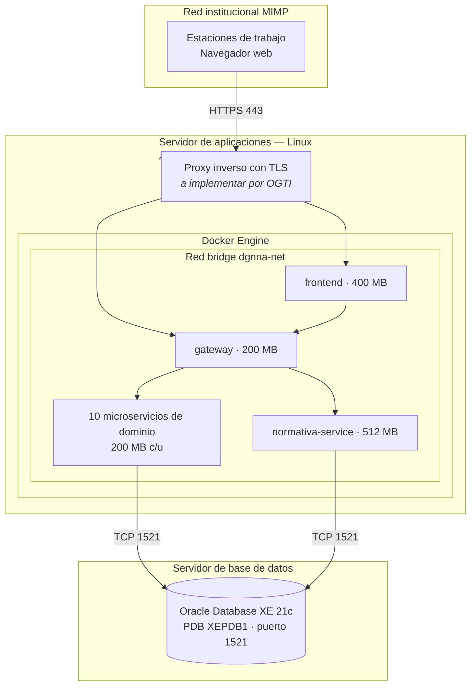

### 8.2. Dimensionamiento

| Recurso | Valor comprometido | Observación |
| :--- | :--- | :--- |
| Memoria de contenedores | ~3.1 GB en límites declarados | Los límites están fijados servicio por servicio en el `docker-compose.yml`. |
| Memoria total recomendada del host | 8 GB mínimo, 16 GB recomendado | El excedente cubre la compilación del frontend y el sistema operativo. |
| CPU | 4 vCPU mínimo | El pico se produce durante `npm run build`, no en operación normal. |
| Almacenamiento | 60 GB mínimo | Imágenes Docker, capas intermedias y registros. Los datos residen en Oracle. |

### 8.3. Estrategia de despliegue

| Escenario | Procedimiento |
| :--- | :--- |
| Despliegue completo | `docker compose up -d --build` |
| Actualización de un módulo | `docker compose up -d --build <servicio>` — no afecta a los demás contenedores |
| Reversión | Reconstrucción desde la revisión anterior, o reetiquetado de imágenes previamente respaldadas |
| Recuperación ante fallo de un contenedor | Automática, por la política `restart: unless-stopped` |

La capacidad de actualizar un módulo sin detener el resto es una consecuencia directa del aislamiento de esquemas descrito en la sección 5.1.

---

## 9. Decisiones de arquitectura

### ADR-001 — Arquitectura de microservicios

**Estado:** Adoptada e implementada.

**Contexto.** El sistema partió de una aplicación monolítica (`backend/`) que concentraba todos los módulos sobre un único esquema Oracle. Cada nuevo módulo incrementaba el riesgo de que un cambio afectara a los módulos ya en producción, y cualquier actualización exigía detener todo el sistema.

**Decisión.** Descomponer el sistema en once microservicios de dominio, un API Gateway y un frontend, cada microservicio con su propio esquema de base de datos.

**Consecuencias favorables.**
- Un módulo puede actualizarse o revertirse sin afectar a los demás.
- El fallo de un módulo degrada solo su funcionalidad.
- Los límites de responsabilidad son explícitos y verificables.
- Permite distribuir el desarrollo de módulos entre equipos distintos.

**Consecuencias desfavorables.**
- Trece contenedores implican mayor carga operativa que un despliegue único.
- Las consultas que cruzan dominios requieren composición en la capa de aplicación, no `JOIN` en base de datos.
- La consistencia entre dominios es eventual, no transaccional.

**Estado de la transición.** El monolito permanece en el directorio `backend/` como referencia histórica y no forma parte del despliegue. Su retiro definitivo se consigna en la sección 11.

---

### ADR-002 — Un esquema Oracle por microservicio

**Estado:** Adoptada e implementada.

**Contexto.** Un esquema compartido habría permitido consultas más simples, pero habría reintroducido el acoplamiento que motivó la separación en microservicios.

**Decisión.** Asignar a cada microservicio un usuario y un esquema Oracle exclusivos, con su propia cadena de conexión.

**Consecuencias favorables.**
- Aislamiento efectivo: ningún servicio puede leer ni alterar los datos de otro.
- El radio de impacto de un incidente queda acotado a un esquema.
- Permite otorgar privilegios mínimos por servicio.
- Facilita respaldos y restauraciones selectivos por módulo.

**Consecuencias desfavorables.**
- Once conjuntos de credenciales que administrar y rotar.
- Los reportes consolidados entre módulos requieren composición en la aplicación.

---

### ADR-003 — API Gateway como punto de entrada único

**Estado:** Adoptada e implementada.

**Contexto.** Exponer once microservicios directamente al navegador habría multiplicado la superficie de exposición y trasladado al frontend la responsabilidad de conocer la topología interna.

**Decisión.** Introducir un API Gateway que valide el token, resuelva el destino por prefijo de ruta y reenvíe la petición.

**Consecuencias favorables.**
- Un único punto de validación de sesión.
- El frontend conoce una sola dirección de servicio.
- La topología interna puede cambiar sin afectar al cliente.
- El endpoint `/health` consolidado facilita el monitoreo.

**Consecuencias desfavorables.**
- Constituye un punto único de fallo para todo el tráfico funcional.
- Añade un salto de red a cada petición.

**Mitigación pendiente.** El Gateway carece hoy de redundancia. Si el nivel de servicio comprometido lo exige, la OGTI puede ejecutar dos instancias tras un balanceador; el diseño no lo impide, ya que el Gateway no mantiene estado.

---

### ADR-004 — Driver `oracledb` en modo thin

**Estado:** Adoptada e implementada.

**Contexto.** El acceso a Oracle desde Python ha requerido tradicionalmente la instalación de Oracle Instant Client, un componente nativo que debe instalarse y versionarse en cada host o imagen.

**Decisión.** Utilizar el paquete `oracledb` en modo thin, que implementa el protocolo de red de Oracle en Python puro.

**Consecuencias favorables.**
- Las imágenes Docker no requieren bibliotecas nativas de Oracle.
- El despliegue se reduce a `pip install` sin pasos de instalación adicionales.
- Elimina una fuente frecuente de incidencias de compatibilidad de versiones.

**Consecuencias desfavorables.**
- El modo thin no soporta algunas funcionalidades avanzadas de Oracle (Advanced Queuing, autenticación externa). El sistema no las utiliza.

---

### ADR-005 — Registro de auditoría asíncrono y no bloqueante

**Estado:** Adoptada e implementada.

**Contexto.** El registro de trazabilidad es un requisito de control interno, pero hacerlo síncrono habría condicionado la disponibilidad de todas las operaciones institucionales a la del servicio de auditoría.

**Decisión.** Emitir los eventos de auditoría de forma asíncrona, sin bloquear ni revertir la operación de negocio si el envío falla.

**Consecuencias favorables.**
- La operación institucional no depende de la disponibilidad del servicio de auditoría.
- No introduce latencia perceptible en las operaciones de negocio.

**Consecuencias desfavorables.**
- No garantiza el registro completo: un evento puede perderse durante una caída del servicio de auditoría.

**Acción recomendada.** Si el marco de control interno exige garantía de registro, incorporar reintento con persistencia local en el emisor o una cola intermedia. La decisión corresponde a la DGNNA en coordinación con el órgano de control.

---

### ADR-006 — Búsqueda vectorial en memoria con NumPy

**Estado:** Adoptada e implementada.

**Contexto.** El módulo de consulta normativa requiere recuperación semántica sobre el corpus del DL 1297 y su Reglamento. La solución habitual —una base de datos vectorial dedicada— habría añadido un componente de infraestructura que la OGTI debería instalar, operar y respaldar.

**Decisión.** Implementar la recuperación vectorial en memoria con NumPy, sobre un corpus acotado al marco normativo de protección de NNA.

**Consecuencias favorables.**
- Cero infraestructura adicional que aprovisionar y mantener.
- Latencia baja para un corpus de este tamaño.
- El índice se reconstruye al arrancar; no requiere respaldo propio.

**Consecuencias desfavorables.**
- No escala a corpus de gran volumen: el índice completo reside en la memoria del contenedor (límite actual: 512 MB).
- El índice se reconstruye en cada arranque, lo que incrementa el tiempo de inicio del servicio.

**Umbral de revisión.** Si el corpus se amplía de forma significativa —por ejemplo, incorporando toda la normativa sectorial del MIMP—, corresponde reevaluar esta decisión frente a Oracle Text o una base vectorial dedicada.

---

### ADR-007 — Asistente de IA como capa opcional

**Estado:** Adoptada e implementada.

**Contexto.** El asistente normativo aporta valor funcional, pero depende de proveedores externos con implicancias de costo, disponibilidad y tratamiento de información.

**Decisión.** Implementar la IA como una capa desactivable mediante la variable `IA_HABILITADA`, manteniendo la búsqueda determinista como funcionalidad base siempre disponible.

**Consecuencias favorables.**
- El sistema es plenamente funcional sin acceso a internet.
- La institución conserva el control sobre la habilitación del servicio y su costo asociado.
- La cascada de respaldo entre tres proveedores evita la dependencia de uno solo.

**Consecuencias desfavorables.**
- Requiere mantener y probar dos rutas de respuesta.

---

### ADR-008 — Creación de esquema mediante `create_all()`

**Estado:** Adoptada, **con revisión recomendada**.

**Contexto.** Se requería un mecanismo de creación de tablas que no obligara a mantener scripts DDL manuales por cada uno de los once esquemas.

**Decisión.** Emplear `Base.metadata.create_all()` de SQLAlchemy durante el arranque de cada microservicio.

**Consecuencias favorables.**
- La instalación inicial no requiere ejecutar DDL manualmente.
- Los modelos ORM son la única fuente de la estructura.

**Consecuencias desfavorables.**
- No aplica cambios sobre tablas ya existentes: una columna nueva en el modelo no llega a la base de datos.
- No deja registro de la versión de esquema desplegada.
- No admite reversión de un cambio estructural.

**Revisión recomendada.** Adoptar Alembic, la herramienta de migraciones del propio ecosistema SQLAlchemy, para versionar la evolución del esquema. Ver sección 11.

---

## 10. Requisitos no funcionales

| Atributo | Requisito | Cómo lo atiende la arquitectura | Estado |
| :--- | :--- | :--- | :--- |
| **Disponibilidad** | El fallo de un módulo no debe interrumpir a los demás. | Microservicios independientes; el Gateway responde 503 solo para el módulo afectado; `restart: unless-stopped` reinicia automáticamente. | Cumplido |
| **Disponibilidad** | Recuperación automática ante caída de un contenedor. | Política de reinicio de Docker. | Cumplido |
| **Disponibilidad** | Ausencia de punto único de fallo. | El Gateway es actualmente un punto único de fallo. | **Pendiente** |
| **Seguridad** | Autenticación obligatoria en toda operación. | Validación JWT en el Gateway. | Cumplido en el diseño; requiere cerrar los puertos 8001-8011. |
| **Seguridad** | Cifrado en tránsito. | Requiere proxy inverso con TLS. | **Pendiente — OGTI** |
| **Seguridad** | Almacenamiento seguro de contraseñas. | `bcrypt` con sal por registro. | Cumplido |
| **Seguridad** | Privilegios mínimos por servicio. | Un usuario Oracle por microservicio, con permisos acotados a su esquema. | Cumplido |
| **Trazabilidad** | Registro de las operaciones sobre expedientes. | `auditoria-service` con visor y exportación. | Cumplido |
| **Mantenibilidad** | Actualizar un módulo sin desplegar el resto. | Aislamiento de contenedor y de esquema. | Cumplido |
| **Mantenibilidad** | Estructura homogénea entre servicios. | Todos comparten el mismo patrón de organización interna. | Cumplido |
| **Mantenibilidad** | Versionado de la estructura de base de datos. | `create_all()` no versiona. | **Pendiente** |
| **Observabilidad** | Punto único de verificación del estado. | `/health` consolidado en el Gateway. | Cumplido |
| **Observabilidad** | Detección de operación en modo degradado. | El respaldo a SQLite del módulo normativo no se refleja en `/health`. | **Pendiente** |
| **Portabilidad** | Despliegue reproducible. | Docker Compose con dependencias fijadas por versión. | Cumplido |
| **Portabilidad** | Independencia de bibliotecas nativas. | Driver `oracledb` en modo thin. | Cumplido |
| **Continuidad** | Operación sin acceso a internet. | Todas las funciones esenciales son locales; solo la IA requiere salida. | Cumplido |
| **Escalabilidad** | Crecimiento por módulo. | Cada microservicio puede replicarse de forma independiente. | Soportado por el diseño; no configurado. |

---

## 11. Deuda técnica identificada

Se consigna de forma explícita para que la OGTI disponga de un panorama completo al momento de asumir el sistema.

| # | Elemento | Descripción | Impacto | Prioridad |
| :-: | :--- | :--- | :--- | :---: |
| 1 | Credenciales versionadas | Archivos `.env` y valores por defecto en el `docker-compose.yml` bajo control de versiones. | Seguridad | **Alta** |
| 2 | Puertos de microservicios expuestos | Los puertos 8001-8011 permiten evadir la validación del Gateway. | Seguridad | **Alta** |
| 3 | Ausencia de TLS | El tráfico, incluidas las credenciales, viaja sin cifrar. | Seguridad | **Alta** |
| 4 | Sin migraciones versionadas | `create_all()` no gestiona la evolución del esquema ni permite reversión. | Mantenibilidad | **Alta** |
| 5 | Inconsistencias en la gestión de usuarios | Divergencias en la aplicación del modelo de autorización entre módulos, según la auditoría del subsistema. | Seguridad / funcional | **Alta** |
| 6 | Tablas POI duplicadas | `POI_CARGAS` y `POI_DATOS` existen en `APELACIONES_DB` y en `POI_DB`, con estructuras distintas (41 frente a 10 columnas). | Integridad de datos | Media |
| 7 | Doble tabla de proceso operativo | Coexisten `PROCESO_OPERATIVO_SUSTRACION` y `PROCESO_OPERATIVO_SUSTRACCION`. Requiere identificar cuál consumen los endpoints antes de consolidar. | Integridad de datos | Media |
| 8 | Códigos de módulo no normalizados | Los valores de `USUARIO_MODULOS.MODULO` no siguen un catálogo único. | Funcional | Media |
| 9 | Monolito residual | El directorio `backend/` conserva la implementación previa, fuera del despliegue. | Claridad | Media |
| 10 | Respaldo a SQLite silencioso | El módulo normativo puede operar degradado sin señal en `/health`. | Observabilidad | Media |
| 11 | Gateway sin redundancia | Punto único de fallo para todo el tráfico funcional. | Disponibilidad | Media |
| 12 | Contenedores como `root` | Ninguna imagen declara un usuario sin privilegios. | Seguridad | Baja |
| 13 | Sin métricas de aplicación | Solo existe verificación binaria de estado; no hay series de latencia ni de errores. | Observabilidad | Baja |

> Los puntos 6 y 7 corresponden a **deuda de migración desde el monolito**. Ninguna de las tablas involucradas debe eliminarse sin analizar previamente las referencias, los endpoints y los registros existentes, y sin un plan de reversión.

---

## 12. Evolución prevista

| Horizonte | Acción | Justificación |
| :--- | :--- | :--- |
| Inmediato | Cerrar los puntos 1, 2 y 3 de la deuda técnica. | Condición previa a la puesta en producción. |
| Corto plazo | Incorporar Alembic para el versionado del esquema. | Habilita la evolución controlada y reversible de la base de datos. |
| Corto plazo | Regularizar el modelo de autorización por módulo. | Cierra las observaciones de la auditoría del subsistema de usuarios. |
| Mediano plazo | Consolidar las tablas duplicadas de POI y de proceso operativo. | Elimina ambigüedad sobre la fuente de verdad. |
| Mediano plazo | Retirar el monolito residual del repositorio. | Reduce la superficie de mantenimiento y evita confusión. |
| Mediano plazo | Exponer el motor de base de datos efectivo en `/health`. | Permite detectar la operación en modo degradado. |
| Largo plazo | Redundancia del API Gateway. | Elimina el punto único de fallo, si el nivel de servicio lo requiere. |
| Largo plazo | Métricas de aplicación y tablero de operación. | Habilita la gestión proactiva del servicio. |
| Según demanda | Reevaluar la estrategia de búsqueda vectorial. | Si el corpus normativo se amplía de forma significativa. |

---

## 13. Glosario

| Término | Definición |
| :--- | :--- |
| **API Gateway** | Componente que concentra el acceso al sistema, valida la sesión y enruta cada petición al servicio correspondiente. |
| **CAR** | Centro de Acogida Residencial. |
| **DEMUNA** | Defensoría Municipal del Niño y del Adolescente. |
| **DGNNA** | Dirección General de Niñas, Niños y Adolescentes. |
| **DL 1297** | Decreto Legislativo para la protección de niñas, niños y adolescentes sin cuidados parentales o en riesgo de perderlos. |
| **JWT** | JSON Web Token. Credencial firmada que acredita una sesión autenticada. |
| **LLM** | Large Language Model. Modelo de lenguaje de gran escala. |
| **Microservicio** | Servicio autónomo, desplegable de forma independiente, propietario de su propio almacén de datos. |
| **NNA** | Niñas, Niños y Adolescentes. |
| **OGTI** | Oficina General de Tecnologías de la Información. |
| **PDB** | Pluggable Database. Base de datos conectable dentro de una instancia Oracle multi-tenant. |
| **POI** | Plan Operativo Institucional. |
| **PP 0117** | Programa Presupuestal 0117 — Atención oportuna de NNA en presunto estado de abandono. |
| **RAG** | Retrieval-Augmented Generation. Técnica que ancla la respuesta de un modelo de lenguaje a documentos previamente recuperados. |
| **RBAC** | Role-Based Access Control. Control de acceso basado en roles. |
| **SAIP** | Solicitud de Acceso a la Información Pública. |
| **SLA** | Service Level Agreement. Acuerdo de nivel de servicio. |
| **UPE** | Unidad de Protección Especial. |

---

*Fin del documento.*
