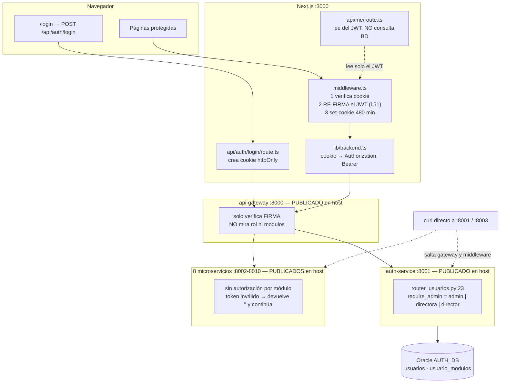
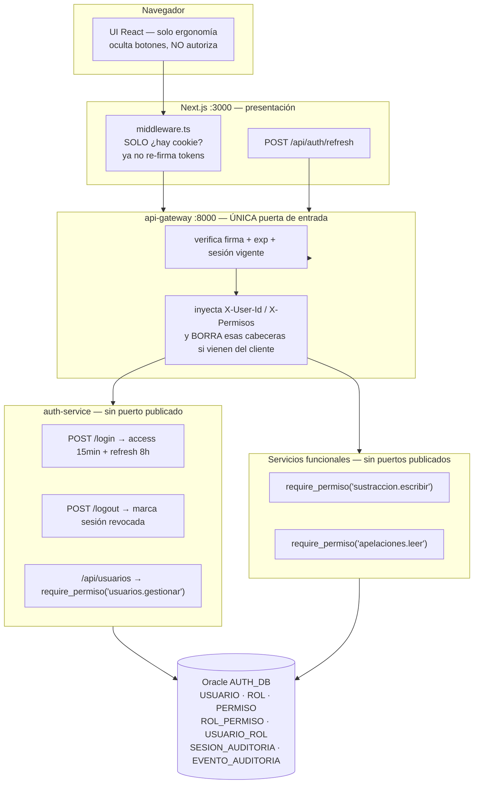

# Auditoría del módulo de Gestión de Usuarios y Autenticación

**Sistema DGNNA — MIMP Perú**
**Fecha:** 28 de agosto de 2026
**Alcance:** autenticación (login/sesión/logout) y gestión de usuarios. No se auditaron los módulos funcionales salvo donde afectan a la autorización.
**Método:** revisión de código en solo lectura por dos perfiles — `qa_process_auditor` (QA y seguridad) y Arquitecto de Software. No se ejecutó el sistema ni se accedió a la base de datos de producción.

---

## 0. Hallazgo previo que condiciona todo el informe

**Existen dos implementaciones vivas y divergentes del mismo módulo.**

| | Monolito legado | Microservicios |
|---|---|---|
| Login | `backend/routers/auth.py` | `servicios/servicio-auth/infrastructure/api/router_auth.py` |
| Usuarios | `backend/routers/usuarios.py` — exige `admin` | `servicios/servicio-auth/infrastructure/api/router_usuarios.py` — acepta `admin`, `directora` o `director` |
| CORS | lista blanca `localhost:3000/3001` (`backend/main.py:104`) | `allow_origin_regex=r"^https?://.*"` (`servicios/api-gateway/main.py:69`) |
| ¿Desplegado? | **No** — `docker-compose.yml` no construye `./backend` | **Sí** — gateway + 9 servicios |

Consecuencia práctica: **las reglas de autorización efectivas del sistema son las de `servicios/`**, y son más laxas que las del código legado. Cualquier corrección aplicada solo en `backend/` no llega a producción.

> **Acción previa a todo lo demás:** confirmar qué se despliega y **eliminar del repositorio la implementación que no se usa** (junto con `frontend/_to_delete/`). Mientras coexistan, el módulo no es certificable.

---

## 1. Cómo funciona hoy

### 1.1 Login

1. `frontend/src/app/login/page.tsx:25` — `POST /api/auth/login` con `{email, password}`. Sin captcha, sin contador de intentos.
2. `frontend/src/app/api/auth/login/route.ts:19` — la route handler de Next reenvía al backend (server-side).
3. `servicios/servicio-auth/domain/services/auth_service.py:24` — busca por email normalizado; si no existe **o** `activo = false` → 401; luego `bcrypt.checkpw` → 401 con **el mismo mensaje** (correcto).
4. **Normalización de rol — aquí divergen las dos implementaciones:**
   - Monolito (`backend/routers/auth.py:27`): `rol = "admin" if usuario.rol == "admin" else "usuario"`.
   - Microservicio (`auth_service.py:36-41`): si el rol de BD es `usuario` pero el usuario tiene **cualquier** módulo con `rolModulo` en (`directora`, `director`), el token se emite con `rol = "directora"`. Esta línea es la raíz del hallazgo crítico F-01.
5. Emisión del JWT: HS256, claims `{userId, nombre, email, rol, modulos, exp}`, `exp = ahora + 480 min`. Sin `iss`, `aud`, `jti`, `nbf`.
6. `frontend/src/app/api/auth/login/route.ts:43-49` — Next guarda el token en la cookie `dgnna_session`: `httpOnly: true`, `sameSite: 'lax'`, `maxAge: 28800`, `secure: process.env.COOKIE_SECURE === 'true'`.

> ✔ El token **nunca** llega al JavaScript del navegador; **no se usa `localStorage`**. Este punto está bien resuelto.

### 1.2 Validación en cada petición — cuatro capas, ninguna completa

| # | Capa | Qué decide realmente | Referencia |
|---|---|---|---|
| 1 | Middleware de Next | Solo *autenticado vs no autenticado*. **No mira `rol` ni `modulos`.** Además **re-firma el token** en cada request | `frontend/src/middleware.ts:23-75`, re-firma en `:50-56` |
| 2 | API Gateway | Solo que el JWT **decodifique**. No mira roles | `servicios/api-gateway/main.py:104,138-143` |
| 3 | `servicio-auth` | Único con control de rol real, y solo en `/api/usuarios` | `router_usuarios.py:20-25` |
| 4 | Cliente React | Oculta botones (`canWrite`, `hasAccess`) — ergonomía, no seguridad | `frontend/src/lib/use-me.ts:27-45` |

**Los 8 microservicios funcionales no tienen ninguna autorización por módulo.** `servicios/servicio-sustracion/infrastructure/api/router.py:23-29` solo extrae `nombre` del token para estamparlo en `creadoPor`, y si el token es inválido **devuelve cadena vacía en lugar de rechazar**.

En ningún punto de la cadena se recarga el usuario desde la base de datos después del login. `get_current_user` (`backend/auth.py:49-56`) devuelve el payload del token tal cual como identidad.

### 1.3 CRUD de usuarios

- **UI:** `frontend/src/app/usuarios/page.tsx` es `'use client'` y el directorio **solo contiene `page.tsx`** — no hay `layout.tsx` ni guarda de servidor. Compárese con `frontend/src/app/menu/page.tsx:5-9`, que sí es Server Component con `getSession()`.
- **Proxy Next:** `api/usuarios/route.ts` y `api/usuarios/[id]/route.ts` son *pass-through* puro, sin ninguna validación.
- **Backend desplegado:** `require_admin` acepta `admin | directora | director`; `usuario_service.py:59-60` asigna `usuario.rol = datos["rol"]` **sin lista blanca**.
- **DELETE:** borrado **físico** (`db.delete(u)`) con `cascade="all, delete-orphan"`. La UI no lo expone (usa baja lógica vía `activo`), pero el endpoint está publicado.

### 1.4 Logout

`router_auth.py:28-30` es literalmente `return {"ok": True}`. El logout solo borra la cookie del navegador. **No hay denylist, ni `jti`, ni `tokenVersion`:** el JWT sigue siendo válido hasta su `exp`.

---

## 2. Hallazgos de seguridad

Severidad: 🔴 Crítica · 🟠 Alta · 🟡 Media · ⚪ Baja

### 🔴 F-01 · Escalada de privilegios: el rol "Directora / Solo visualización" administra el sistema

`router_usuarios.py:23` · `usuario_service.py:59-60` · `auth_service.py:36-41` · `frontend/src/app/usuarios/page.tsx:38-41`

```python
# auth_service.py:37-40 — cómo se llega a ser "directora"
if any(m.rolModulo in ("directora", "director") for m in usuario.modulos):
    rol = "directora"

# router_usuarios.py:23 — y por qué eso basta para administrar
if not payload or payload.get("rol") not in ("admin", "directora", "director"):
    raise HTTPException(status_code=403, ...)

# usuario_service.py:59-60 — sin whitelist, sin normalizar
if datos.get("rol") is not None:
    usuario.rol = datos["rol"]
```

**Explotación:** la UI ofrece `Directora / Solo visualización` como `rolModulo` de cualquier módulo. Un usuario creado así recibe un token con `rol="directora"`, pasa `require_admin`, y ejecuta `PUT /api/usuarios/<su_propio_id>` con `{"rol":"admin"}`. Al siguiente login es administrador global. Alternativamente cambia la contraseña del admin, o lo elimina.

**Impacto:** un perfil etiquetado como "solo visualización" es de facto superadministrador de un sistema que trata expedientes de sustracción internacional de NNA. **Se corrige en dos líneas.**

### 🔴 F-02 · Secreto JWT hardcodeado, débil, compartido por 11 servicios y versionado en Git

`backend/auth.py:15` · `servicios/api-gateway/main.py:32` · `auth_service.py:14` · `frontend/src/middleware.ts:6` · `frontend/src/lib/auth.ts:11` · `docker-compose.yml:39,64,83,102,121,140,159,178,197,216`

```python
SECRET_KEY = os.getenv("SESSION_SECRET", "dgnna-sistema-dgnna-secret-2026")
```

`git ls-files` confirma que **los archivos `.env` están commiteados** (`backend/.env`, `frontend/.env.local` y los de `servicios/`). `.gitignore` no excluye `.env`. En ellos figuran el secreto de sesión, las contraseñas Oracle de los 9 esquemas (`Auth2026`, `Apelaciones2026`, `123456`…) y una API key activa de Google Maps.

**Explotación:** cualquiera con acceso al repositorio firma `{"userId":"x","rol":"admin","modulos":[],"exp":<futuro>}` con esa clave, la pega en la cookie `dgnna_session` y es administrador **sin credenciales y sin tocar la base de datos**. El mismo secreto vale para los 11 contenedores: cada uno puede *fabricar* tokens de administrador, no solo validarlos.

**Agravante:** el valor por defecto está en el código, así que un despliegue que olvide la variable arranca "funcionando" con la clave pública.

### 🔴 F-03 · Bomba de tiempo: el contenedor `frontend` nunca recibe `SESSION_SECRET`

`docker-compose.yml:18-22` · `frontend/Dockerfile:21-24`

El servicio `frontend` define `NODE_ENV`, `BACKEND_URL`, `BACKEND_INTERNAL_URL` y `NEXT_PUBLIC_BACKEND_URL` — **no `SESSION_SECRET`** — y el Dockerfile no copia `.env.local`. El middleware usa siempre el fallback hardcodeado, mientras gateway y auth-service usan `${SESSION_SECRET:-…}`.

**Hoy funciona solo porque ambos valores coinciden.** El día que se ponga un secreto real en el `.env` de Docker, **todo login entrará en bucle de redirección a `/login` sin mensaje de error**. Es decir: en su estado actual el sistema *no puede* rotar su secreto sin romperse. Rotar el secreto y añadirlo al servicio `frontend` son un cambio atómico.

### 🔴 F-04 · Los 9 microservicios publican sus puertos al host: el gateway es opcional

`docker-compose.yml` publica `8001:8001` … `8010:8010`. Cualquiera con acceso de red a la máquina llama directamente a `auth-service:8001` o a `sustracion-service:8003` **saltándose el gateway y el middleware de Next**. Como los servicios funcionales no validan permisos por módulo, un token válido de *cualquier* usuario activo lee y escribe expedientes de NNA.

### 🟠 F-05 · Desactivar, degradar o eliminar a un usuario no corta su sesión

`frontend/src/middleware.ts:50-56` · `frontend/src/app/api/me/route.ts:9-15`

```ts
const { exp: _exp, iat: _iat, ...datos } = payload
const nuevoToken = await new SignJWT(datos)
  .setIssuedAt()
  .setExpirationTime(`${SESSION_MINUTES}m`)   // 480 min, otra vez
  .sign(SECRET)
```

El middleware **re-firma el token en cada petición** copiando el payload viejo (rol y módulos incluidos) y renovando 8 horas. Nunca consulta la base de datos. `/api/me` también lee del propio JWT.

- Se desactiva a un empleado cesado: mientras tenga la pestaña abierta, **su sesión no caduca jamás**. `activo` solo se comprueba en el login.
- Se degrada a un admin: conserva `rol:"admin"` en su token y sigue creando y borrando usuarios.
- `DELETE /api/usuarios/{id}` tampoco revoca nada.

**No existe capacidad real de revocación de acceso.** Incompatible con cualquier procedimiento de cese de personal y con el deber de control de acceso de la Ley N.° 29733.

### 🟠 F-06 · Sin rate limiting ni bloqueo por intentos fallidos

`grep` de `slowapi|ratelimit|intentos|lockout|bloqueo|failed_attempts` sobre todo el árbol: **cero resultados**. `/api/auth/login` está además en `PUBLIC_PATHS` del gateway (`api-gateway/main.py:36`) y el puerto está publicado al host. Fuerza bruta y *password spraying* sin límite ni detección, contra emails institucionales predecibles.

### 🟠 F-07 · Sin política de contraseñas y credenciales por defecto publicadas

`backend/reset_admin.py:30,52` · `backend/seed.py:40,48` · `backend/schemas.py:189`

```python
NUEVA_CONTRASENA = "123456"                    # reset_admin.py:30
print("  Usuario admin: admin@dgnna.gob.pe / Admin2026!")   # seed.py:48
```

`password: str` sin `min_length` ni validador; `email: str` sin `EmailStr`. El formulario de creación no impone longitud mínima; el de cambio impone 6 **solo en cliente**. Además `reset_admin.py` es un backdoor operativo: resetea la contraseña del admin sin conocer la anterior, imprime el listado completo de usuarios y roles, y no deja rastro.

### 🟠 F-08 · Ausencia total de trazabilidad y auditoría

No existe ninguna tabla, log ni evento de: login exitoso, login fallido, logout, alta/baja/cambio de rol, ni cambio de contraseña. `Usuario` solo tiene `createdAt`/`updatedAt`, sin `creadoPor`/`modificadoPor` — a diferencia de otros módulos del sistema, que sí lo tienen. El único rastro de autoría en los servicios funcionales es `creadoPor` con el **nombre en texto libre** tomado del JWT, no el `userId`.

**Escenario:** alguien crea una cuenta, accede a expedientes de sustracción internacional y la borra físicamente. **No queda absolutamente ningún rastro.** Un incidente sería irreconstruible, y la atribución de responsabilidad imposible.

### 🟡 F-09 · Borrado físico de usuarios, sin restricciones

`router_usuarios.py` (DELETE) · `backend/models.py:114,121`

`db.delete(u)` con cascade. El endpoint no valida que no sea el último administrador ni que no sea uno mismo. `DELETE /api/usuarios/<id-del-único-admin>` deja **el sistema sin ningún administrador y sin recuperación desde la aplicación** — solo mediante `reset_admin.py` sobre el filesystem.

### 🟡 F-10 · Un admin puede auto-degradarse o auto-desactivarse

El `PUT` no compara `id` con el del actor. Peor: el handler declara `_: dict = Depends(require_admin)` — **descarta la identidad de quien actúa**, lo que además impide implementar auditoría o guardas de auto-modificación sin refactorizar la firma.

### 🟡 F-11 · La cookie de sesión no es `Secure`

`secure: process.env.COOKIE_SECURE === 'true'` — y `COOKIE_SECURE` **no está definida en ningún `.env` ni en `docker-compose.yml`**. No se observó terminación TLS en el despliegue. En la red interna del MIMP, cualquiera con acceso al segmento captura la cookie en claro y suplanta la sesión de un administrador; con F-05, el logout de la víctima no lo detiene.

### 🟡 F-12 · CORS del gateway acepta cualquier origen con credenciales

`api-gateway/main.py:67-73`: `allow_origin_regex=r"^https?://.*"` con `allow_credentials=True`, `allow_methods=["*"]`. El monolito sí tiene lista blanca — otra divergencia. Mitigante: el gateway se autentica por cabecera `Authorization`, no por cookie. Aun así elimina toda defensa de origen sobre un puerto publicado al host.

### 🟡 F-13 · Sin defensa CSRF explícita

Las rutas mutantes no validan token anti-CSRF, `Origin`/`Referer` ni `Content-Type`. La única barrera es `SameSite=Lax`, delegada al navegador. Cualquier regresión (pasar a `SameSite=None` para un iframe institucional, un navegador antiguo del parque del MIMP, un subdominio comprometido) reabre el CSRF completo.

### 🟡 F-14 · La página `/usuarios` no tiene guarda de rol en el servidor

El middleware deja pasar a cualquier sesión válida. Un registrador que navegue a `/usuarios` ve la consola completa de administración: formulario de creación, catálogo de módulos internos, semántica de roles y rutas de la API. El `GET` devuelve 403 y solo se muestra un *toast*. El dato no se filtra, pero sí toda la superficie administrativa.

### 🟡 F-15 · Enumeración de usuarios por canal lateral de tiempo

`bcrypt.checkpw` solo se ejecuta si el usuario existe y está activo; el mensaje y el código de estado son idénticos (bien), pero la latencia difiere en dos órdenes de magnitud. Sin rate limiting, se cronometran miles de emails `nombre.apellido@dgnna.gob.pe` y se obtiene la nómina exacta de cuentas activas, incluidas las de administración.

### ⚪ F-16 · Cambio de email sin control de duplicados → error 500

El `POST` valida duplicados y responde 409 limpio; el `PUT` no (`u.email = body.email.lower().strip()` sin comprobación). `IntegrityError` no capturado → 500 con traza. Además, sin `EmailStr`, un email inválido guardado deja la cuenta permanentemente sin poder iniciar sesión.

### ⚪ F-17 · Debilidades menores del JWT

Sin `iss`, `aud`, `jti`, `nbf` — el token no está ligado a una aplicación ni es identificable individualmente, lo que **impide construir una denylist**. `datetime.utcnow()` deprecado y *naive*. `modulos` viaja completo en cada cookie de cada request. `require_module_access` hace `m["modulo"]` sobre elementos del token: un `modulos` malformado produce `TypeError` → 500 en vez de 403. `LoginResponse` expone `access_token` en el cuerpo JSON, susceptible de acabar en logs.

### ✔ Controles que SÍ están bien resueltos

| Aspecto | Estado | Evidencia |
|---|---|---|
| Hashing de contraseñas | bcrypt con `gensalt()` por usuario | `backend/auth.py:24-29`, `auth_service.py:74-75` |
| Verificación de firma JWT | Correcta en las 4 capas; `algorithms` siempre fijado (no vulnerable a `alg:none`) | `backend/auth.py:42`, `middleware.ts:45`, `api-gateway/main.py:140` |
| Almacenamiento del token | Cookie `httpOnly`; **no** `localStorage` | `api/auth/login/route.ts:43-49` |
| Filtración del hash en la API | No ocurre: `UsuarioOut` no incluye `passwordHash` | `backend/schemas.py:201-211` |
| Mensaje de error del login | Idéntico para usuario inexistente, inactivo y contraseña errónea | `routers/auth.py:22,25` |
| IDOR clásico (A edita a B) | No aplica: no hay endpoint self-service de perfil | los 5 endpoints exigen rol de administración |

---

## 3. Análisis arquitectónico

### 3.1 Arquitectura actual (as-is)



### 3.2 Debilidades estructurales

**a) El frontend es emisor de tokens.** `middleware.ts:51` firma JWTs con el mismo secreto que el backend. La capa expuesta al navegador tiene poder de acuñación de credenciales. Es la anomalía arquitectónica más profunda del módulo: de ella se derivan F-03 y F-05.

**b) Secreto compartido por 11 contenedores.** No hay separación entre "quien emite" y "quien valida". Cualquier servicio comprometido puede fabricar un token de administrador. Rotar la clave exige tocar 11 lugares.

**c) La autorización está en cuatro sitios y en ninguno completa.** Middleware (solo autenticación), gateway (solo firma), `servicio-auth` (solo `/api/usuarios`), cliente React (solo cosmética). El resultado es que la única barrera real contra la escritura indebida en 8 de los 9 módulos **es que la interfaz oculte un botón**.

**d) Modelo de roles: strings sueltos sin fuente de verdad.**

| Concepto | Tipo real | Validación | Fuente de verdad |
|---|---|---|---|
| `usuarios.rol` | `VARCHAR2(20)` | ninguna | un comentario en `models.py:18` |
| `usuario_modulos.modulo` | `VARCHAR2(50)` | ninguna | un array TypeScript en `usuarios/page.tsx:26-36` |
| `usuario_modulos.rolmodulo` | `VARCHAR2(50)` | ninguna | un array TypeScript en `usuarios/page.tsx:38-41` |

Sin `CHECK`, sin enum Python, sin `Literal` en Pydantic. Un typo (`"sustracción"` con tilde vs `"sustraccion"`) crea un permiso que nunca coincidirá y **nadie se entera**. No existen tablas `Rol`/`Permiso`: el permiso es la tupla implícita `(modulo, rolModulo)` y su semántica vive repartida entre cuatro archivos.

**e) Divergencia de la regla "puede escribir" entre capas:**

| Capa | Regla | Referencia |
|---|---|---|
| Cliente React | admin **o** `rolModulo === 'registrador'` | `lib/use-me.ts:27-31` |
| Helper de servidor Next | admin **o** `rolModulo === 'registrador'` | `lib/auth.ts:51-53` |
| Entidad de dominio | admin **o** tener el módulo (**ignora `rolModulo`**) | `domain/entities/usuario.py:35-38` |
| Microservicios funcionales | **ninguna** | — |

`Usuario.puede_escribir()` es hoy idéntico a `tiene_acceso_modulo()` y además **no se invoca desde ningún sitio**.

**f) Capas y testabilidad desiguales.** `servicio-auth` **sí** tiene la separación correcta (`domain/entities`, `domain/ports`, `domain/services`, `infrastructure/db`) — es el mejor código del repositorio y debe ser el patrón de referencia. Pero: `servicio-transparencia` y `servicio-mapa` hacen SQLAlchemy directo en el router; `backend/routers/usuarios.py` va de router a `db.query()` sin capa intermedia; y **`servicio-auth` no tiene ningún test** pese a ser el servicio crítico, cuando su capa de dominio no importa FastAPI ni SQLAlchemy y es trivialmente testeable.

**g) Sin migraciones versionadas.** `Base.metadata.create_all` en lugar de Alembic; el caso extremo es `backend/main.py:20-93`, con ~50 `ALTER TABLE` en un bucle `try/except`.

**h) Configuración que se degrada en silencio.** Todos los secretos tienen valor por defecto en el código. Un despliegue mal configurado no falla: arranca inseguro.

### 3.3 Arquitectura objetivo (to-be)



Cuatro cambios estructurales: **(a)** el frontend deja de emitir tokens; **(b)** el gateway es la única entrada, porque los demás puertos dejan de publicarse; **(c)** cada endpoint declara el permiso que exige; **(d)** existe estado de sesión en base de datos, por lo que **revocar es posible**.

### 3.4 Modelo de datos propuesto (DDL Oracle orientativo)

Diseñado sobre el esquema `AUTH_DB` existente, conservando `VARCHAR2(36)` como PK para no romper los UUID actuales.

```sql
-- 1. USUARIO (evolución de la tabla 'usuarios' actual)
CREATE TABLE auth_db.usuario (
    id                  VARCHAR2(36)  PRIMARY KEY,
    nombre              VARCHAR2(200) NOT NULL,
    email               VARCHAR2(200) NOT NULL,
    documento_identidad VARCHAR2(15),
    passwordhash        VARCHAR2(200),                -- NULL si autentica por LDAP MIMP
    origen_auth         VARCHAR2(10)  DEFAULT 'LOCAL' NOT NULL,
    activo              NUMBER(1)     DEFAULT 1 NOT NULL,
    debe_cambiar_pwd    NUMBER(1)     DEFAULT 1 NOT NULL,
    ultimo_login        TIMESTAMP,
    intentos_fallidos   NUMBER(3)     DEFAULT 0 NOT NULL,
    bloqueado_hasta     TIMESTAMP,
    createdat           TIMESTAMP     DEFAULT SYSTIMESTAMP NOT NULL,
    updatedat           TIMESTAMP     DEFAULT SYSTIMESTAMP NOT NULL,
    CONSTRAINT uq_usuario_email  UNIQUE (email),
    CONSTRAINT ck_usuario_origen CHECK (origen_auth IN ('LOCAL','LDAP'))
);

-- 2. ROL (catálogo, ya no un string suelto)
CREATE TABLE auth_db.rol (
    id          VARCHAR2(36)  PRIMARY KEY,
    codigo      VARCHAR2(40)  NOT NULL,   -- ADMIN, DIRECTOR, REGISTRADOR, CONSULTA
    nombre      VARCHAR2(120) NOT NULL,
    descripcion VARCHAR2(400),
    es_sistema  NUMBER(1) DEFAULT 0 NOT NULL,
    activo      NUMBER(1) DEFAULT 1 NOT NULL,
    CONSTRAINT uq_rol_codigo UNIQUE (codigo)
);

-- 3. PERMISO (grano fino: modulo + accion)
CREATE TABLE auth_db.permiso (
    id          VARCHAR2(36)  PRIMARY KEY,
    codigo      VARCHAR2(80)  NOT NULL,   -- 'sustraccion.escribir', 'usuarios.gestionar'
    modulo      VARCHAR2(50)  NOT NULL,
    accion      VARCHAR2(30)  NOT NULL,
    descripcion VARCHAR2(400),
    CONSTRAINT uq_permiso_codigo UNIQUE (codigo),
    CONSTRAINT ck_permiso_accion CHECK (accion IN
        ('leer','escribir','eliminar','exportar','gestionar'))
);

-- 4. ROL_PERMISO
CREATE TABLE auth_db.rol_permiso (
    rol_id     VARCHAR2(36) NOT NULL,
    permiso_id VARCHAR2(36) NOT NULL,
    CONSTRAINT pk_rol_permiso PRIMARY KEY (rol_id, permiso_id),
    CONSTRAINT fk_rp_rol     FOREIGN KEY (rol_id)     REFERENCES auth_db.rol(id)     ON DELETE CASCADE,
    CONSTRAINT fk_rp_permiso FOREIGN KEY (permiso_id) REFERENCES auth_db.permiso(id) ON DELETE CASCADE
);

-- 5. USUARIO_ROL (reemplaza usuario_modulos; el ámbito es el módulo)
CREATE TABLE auth_db.usuario_rol (
    id           VARCHAR2(36) PRIMARY KEY,
    usuario_id   VARCHAR2(36) NOT NULL,
    rol_id       VARCHAR2(36) NOT NULL,
    modulo       VARCHAR2(50),              -- NULL = rol global (p.ej. ADMIN)
    asignado_por VARCHAR2(36),
    asignado_en  TIMESTAMP DEFAULT SYSTIMESTAMP NOT NULL,
    CONSTRAINT fk_ur_usuario FOREIGN KEY (usuario_id) REFERENCES auth_db.usuario(id) ON DELETE CASCADE,
    CONSTRAINT fk_ur_rol     FOREIGN KEY (rol_id)     REFERENCES auth_db.rol(id),
    CONSTRAINT uq_usuario_rol_modulo UNIQUE (usuario_id, rol_id, modulo)
);

-- 6. SESION_AUDITORIA (lo que hoy no existe: sesión revocable)
CREATE TABLE auth_db.sesion_auditoria (
    id               VARCHAR2(36) PRIMARY KEY,   -- = jti del refresh token
    usuario_id       VARCHAR2(36) NOT NULL,
    emitida_en       TIMESTAMP DEFAULT SYSTIMESTAMP NOT NULL,
    expira_en        TIMESTAMP NOT NULL,
    ultima_actividad TIMESTAMP,
    revocada_en      TIMESTAMP,
    motivo_fin       VARCHAR2(30),   -- LOGOUT | EXPIRACION | REVOCADA_ADMIN | BAJA_USUARIO
    ip_origen        VARCHAR2(45),
    user_agent       VARCHAR2(400),
    CONSTRAINT fk_sesion_usuario FOREIGN KEY (usuario_id) REFERENCES auth_db.usuario(id)
);
CREATE INDEX ix_sesion_usuario_activa ON auth_db.sesion_auditoria (usuario_id, revocada_en);

-- 7. EVENTO_AUDITORIA (Ley 29733: quién hizo qué, cuándo, sobre qué)
CREATE TABLE auth_db.evento_auditoria (
    id            VARCHAR2(36) PRIMARY KEY,
    ocurrido_en   TIMESTAMP DEFAULT SYSTIMESTAMP NOT NULL,
    usuario_id    VARCHAR2(36),
    email_intento VARCHAR2(200),
    evento        VARCHAR2(40) NOT NULL,   -- LOGIN_OK | LOGIN_FALLIDO | LOGOUT |
                                           -- USUARIO_CREADO | ROL_ASIGNADO | PWD_CAMBIADA | ACCESO_DENEGADO
    entidad       VARCHAR2(50),
    entidad_id    VARCHAR2(36),
    detalle       VARCHAR2(1000),          -- JSON corto; NUNCA datos de NNA ni contraseñas
    ip_origen     VARCHAR2(45)
);
CREATE INDEX ix_evento_fecha   ON auth_db.evento_auditoria (ocurrido_en);
CREATE INDEX ix_evento_usuario ON auth_db.evento_auditoria (usuario_id, ocurrido_en);
```

Semilla de roles que fija la decisión clave:

```sql
INSERT INTO auth_db.rol (id,codigo,nombre,es_sistema) VALUES (sys_guid(),'ADMIN','Administrador del sistema',1);
INSERT INTO auth_db.rol (id,codigo,nombre,es_sistema) VALUES (sys_guid(),'DIRECTOR','Directora / Dirección',1);
INSERT INTO auth_db.rol (id,codigo,nombre,es_sistema) VALUES (sys_guid(),'REGISTRADOR','Registrador / Especialista',1);
INSERT INTO auth_db.rol (id,codigo,nombre,es_sistema) VALUES (sys_guid(),'CONSULTA','Solo lectura',1);
-- DIRECTOR NO recibe 'usuarios.gestionar'. Solo ADMIN.
-- Ésa es exactamente la escalada que hoy existe en router_usuarios.py:23.
```

### 3.5 Dependencia de autorización reutilizable

Archivo propuesto: `shared/autorizacion.py`, copiado a cada servicio y al gateway. Con un equipo pequeño y sin registro privado de paquetes, copiar 60 líneas es más barato y menos frágil que publicar una librería interna.

```python
# shared/autorizacion.py
# Sustituye a: backend/auth.py:59 require_admin, :65 require_module_access,
#              :78 can_write, y router_usuarios.py:20 require_admin
import os
from dataclasses import dataclass

import jwt as pyjwt
from fastapi import Depends, HTTPException, Request, status
from fastapi.security import HTTPBearer, HTTPAuthorizationCredentials

_ALG = "HS256"
_bearer = HTTPBearer(auto_error=False)


def _secreto() -> str:
    s = os.getenv("SESSION_SECRET")
    if not s or len(s) < 32:
        # Falla al arrancar en vez de degradarse a un secreto público.
        raise RuntimeError("SESSION_SECRET ausente o demasiado corto.")
    return s


@dataclass(frozen=True)
class Principal:
    usuario_id: str
    nombre: str
    email: str
    permisos: frozenset[str]   # {'sustraccion.escribir', 'apelaciones.leer', ...}
    sesion_id: str             # jti — permite revocar

    def tiene(self, permiso: str) -> bool:
        modulo = permiso.split(".", 1)[0]
        return permiso in self.permisos or f"{modulo}.*" in self.permisos or "*" in self.permisos


def get_principal(cred: HTTPAuthorizationCredentials | None = Depends(_bearer)) -> Principal:
    if cred is None:
        raise HTTPException(status.HTTP_401_UNAUTHORIZED, "No autenticado")
    try:
        p = pyjwt.decode(
            cred.credentials, _secreto(), algorithms=[_ALG],
            issuer="dgnna-auth", audience="dgnna-api",
            options={"require": ["exp", "iat", "jti", "sub"]},
        )
    except pyjwt.PyJWTError:
        raise HTTPException(status.HTTP_401_UNAUTHORIZED, "Sesión inválida o expirada")

    return Principal(
        usuario_id=p["sub"], nombre=p.get("nombre", ""), email=p.get("email", ""),
        permisos=frozenset(p.get("permisos", [])), sesion_id=p["jti"],
    )


def require_permiso(*permisos: str, modo: str = "cualquiera"):
    def _dep(request: Request, yo: Principal = Depends(get_principal)) -> Principal:
        ok = (all if modo == "todos" else any)(yo.tiene(p) for p in permisos)
        if not ok:
            _auditar_acceso_denegado(yo, permisos, request)   # → EVENTO_AUDITORIA
            raise HTTPException(status.HTTP_403_FORBIDDEN, "Permiso insuficiente")
        return yo
    return _dep
```

Aplicación en el router de usuarios, corrigiendo F-01 y F-10 a la vez:

```python
# servicios/servicio-auth/infrastructure/api/router_usuarios.py
GESTION = Depends(require_permiso("usuarios.gestionar"))   # solo el rol ADMIN lo tiene

@router.put("/{id}", response_model=UsuarioOut)
def actualizar(id: str, body: UsuarioUpdate,
               service: UsuarioService = Depends(get_usuario_service),
               yo: Principal = GESTION):
    if id == yo.usuario_id and body.activo is False:
        raise HTTPException(400, "No puede desactivarse a sí mismo")
    usuario = service.actualizar(id, body.model_dump(exclude_none=True), actor_id=yo.usuario_id)
    service.revocar_sesiones(id, motivo="REVOCADA_ADMIN")   # el cambio surte efecto YA
    return _usuario_out(usuario)
```

Y en un servicio funcional, que hoy no tiene nada:

```python
# servicios/servicio-sustracion/infrastructure/api/router.py
LEER     = Depends(require_permiso("sustraccion.leer"))
ESCRIBIR = Depends(require_permiso("sustraccion.escribir"))

@router.post("", response_model=CasoSustracionOut, status_code=201)
def crear(body: CasoSustracionCreate, yo: Principal = ESCRIBIR, ...):
    return service.crear(body.model_dump(), creado_por_id=yo.usuario_id)  # id, no nombre libre
```

### 3.6 Estrategia de tokens

| | Access token | Refresh token |
|---|---|---|
| Vida | **15 min** | **8 h** (jornada); inactividad máx. 30 min |
| Contenido | `sub, jti, nombre, email, permisos[], iss, aud, exp, iat` | `sub, jti, iss, aud, exp` (sin permisos) |
| Cookie | `dgnna_at` — httpOnly, `SameSite=Strict`, `Secure`, `Path=/` | `dgnna_rt` — httpOnly, `Secure`, **`Path=/api/auth/refresh`** |
| Emisor | **solo** `auth-service` | **solo** `auth-service` |
| Revocable | no (vive 15 min) | **sí** — `jti` = `SESION_AUDITORIA.id` |

1. **`middleware.ts` deja de firmar tokens** (se elimina el `SignJWT` de la línea 51). El frontend pierde la capacidad de acuñar credenciales; su única función pasa a ser: si no hay cookie → `/login`.
2. **La ventana de propagación de permisos baja de "infinita" a 15 minutos**, porque el refresh consulta `SESION_AUDITORIA` y `USUARIO.activo` antes de emitir un access nuevo. Revocar la sesión expulsa al instante.
3. **`SameSite=Strict`** en lugar de `lax`: el sistema es interno y no recibe navegación entrante de terceros; no hay coste funcional.
4. **`Secure` incondicional**, sin depender de una variable no declarada. Requiere TLS (decisión D3).
5. `iss` / `aud` y `options={"require": [...]}` impiden aceptar tokens de otro origen o sin `exp`.

### 3.7 Gestión de configuración

```python
# shared/config.py — falla al arrancar en lugar de degradarse
from pydantic import Field, field_validator
from pydantic_settings import BaseSettings

class Config(BaseSettings):
    SESSION_SECRET: str = Field(min_length=32)   # sin default: obligatorio
    DATABASE_URL:   str                          # sin default: obligatorio
    ACCESS_MIN:  int = 15
    REFRESH_MIN: int = 480
    COOKIE_SECURE: bool = True                   # seguro por defecto
    ENTORNO: str = "produccion"

    @field_validator("SESSION_SECRET")
    @classmethod
    def _no_default(cls, v: str) -> str:
        if v == "dgnna-sistema-dgnna-secret-2026":
            raise ValueError("SESSION_SECRET es el valor público del repositorio. Rótelo.")
        return v

config = Config()
```

En operación: `.env` fuera de Git (`git rm --cached` de los ya versionados + rotación de todos los secretos, que siguen en el historial); en `docker-compose.yml` reemplazar `${VAR:-valor}` por `${VAR:?definir en .env}` para que Compose se niegue a levantar sin secretos; **añadir `SESSION_SECRET` al servicio `frontend`**; retirar los `ports:` de los 9 microservicios.

---

## 4. Plan de migración incremental

Ordenado por relación valor/riesgo. **Las fases 0 a 3 no requieren migración de datos.**

### Fase 0 — Contención inmediata · 0,5 días-persona · sin migración

**Objetivo:** cerrar la escalada de privilegios y dejar de publicar la superficie de ataque. Máximo valor, mínimo esfuerzo.

| Archivo | Cambio |
|---|---|
| `servicios/servicio-auth/infrastructure/api/router_usuarios.py:23` | `not in ("admin","directora","director")` → `!= "admin"` |
| `servicios/servicio-auth/domain/services/auth_service.py:37-42` | Eliminar la promoción automática a `rol="directora"`; el rol global sale de la BD |
| `docker-compose.yml` (bloques de los 9 servicios) | Borrar los `ports:` de los microservicios |
| `docker-compose.yml:18-22` | Añadir `SESSION_SECRET=${SESSION_SECRET:?}` y `COOKIE_SECURE=true` al servicio `frontend` |
| `.gitignore` | Añadir `.env`, `.env.*`, `!.env.example` |
| — | `git rm --cached` de los `.env`; **rotar** el secreto de sesión, las contraseñas Oracle y la API key de Google Maps |

**Riesgo — medio-alto y concreto:** (a) si alguna directora usa hoy `/usuarios`, pierde el acceso: confirmarlo antes y, si procede, asignarle rol `admin` explícito; (b) al rotar el secreto **todas las sesiones vivas caen** — hacerlo fuera de horario; (c) si algún `.bat` o script llama directo a `localhost:800X`, dejará de funcionar; (d) rotar el secreto **sin** añadirlo al servicio `frontend` produce un bucle de login — los dos cambios son atómicos.

**Criterio de aceptación:** un usuario con `rolModulo='directora'` recibe 403 en `GET /api/usuarios`; `curl http://localhost:8001/api/usuarios` desde el host da *connection refused*; `docker compose config` no muestra ninguna contraseña; el login funciona con el secreto nuevo; `npx tsc --noEmit` sigue en 0 errores (AGENTS.md §3).

### Fase 1 — Auditoría y sesiones revocables · 3 días-persona · aditivo

**Objetivo:** poder responder "¿quién accedió a este expediente y cuándo?" y poder expulsar a alguien. Mínimo exigible por la Ley N.° 29733.

- Crear `EVENTO_AUDITORIA` y `SESION_AUDITORIA` (§3.4) — **tablas nuevas, no se toca ninguna existente**.
- `auth_service.py`: registrar `LOGIN_OK` / `LOGIN_FALLIDO`; incrementar `intentos_fallidos`; bloquear 15 min a los 5 intentos; crear fila de sesión con `jti`.
- `router_auth.py` — `logout` deja de ser `{"ok": True}` y marca la sesión revocada.
- Nuevos `POST /api/auth/refresh` y `POST /api/usuarios/{id}/revocar-sesiones`.
- `usuario_service.py`: cada alta/baja/cambio de rol emite un evento con el `actor_id`.
- `DELETE /api/usuarios/{id}` pasa a **baja lógica** para no perder la trazabilidad.

**Riesgo — bajo.** Todo es aditivo. Si la escritura de auditoría falla no debe tumbar el login, pero sí debe alertar.

**Criterio de aceptación:** 3 logins fallidos + 1 correcto producen 4 filas en `EVENTO_AUDITORIA`; tras revocar sesiones, el siguiente refresh de ese usuario devuelve 401; el borrado de usuario ya no elimina la fila.

### Fase 2 — `require_permiso` en los servicios funcionales · 4 días-persona (+1 semana de observación) · sin migración

**Objetivo:** que la autorización deje de depender de que el navegador oculte un botón.

- Nuevo `shared/autorizacion.py` (§3.5) copiado a los 9 servicios + gateway.
- **Adaptador temporal:** mientras el JWT siga llevando `modulos`, `Principal.permisos` se *deriva* de ellos (`registrador` → `<modulo>.leer` + `<modulo>.escribir`; `directora` → `<modulo>.leer`). Esto permite aplicar la fase **sin tocar la BD ni el formato del token**.
- Anotar cada endpoint de los 9 servicios; sustituir `creado_por` (nombre libre) por `creado_por_id`, conservando la columna vieja.
- Corregir `domain/entities/usuario.py:35-38` (`puede_escribir` que ignora `rolModulo`).
- Gateway: borrar las cabeceras `X-User-*` entrantes antes de reenviar.

**Riesgo — ALTO. Es la fase peligrosa del plan.** Al activar permisos reales aparecerán 403 en flujos que hoy funcionan porque nadie comprobaba nada.

> **Mitigación obligatoria:** desplegar primero en **modo observación** — registrar `ACCESO_DENEGADO` en auditoría pero **dejar pasar** — durante una semana de uso real; revisar el log; ajustar la matriz de permisos; y solo entonces activar el rechazo. Servicio por servicio, empezando por el de menor criticidad (`sala-reuniones`) y dejando `sustraccion` para el final.

**Criterio de aceptación:** un usuario con acceso solo a `apelaciones` recibe 403 en `POST /api/sustracion` llamando **directamente al gateway**; una semana de log de observación sin denegaciones inesperadas antes de activar.

### Fase 3 — Tokens cortos + refresh; el frontend deja de firmar · 3 días-persona · sin migración

| Archivo | Cambio |
|---|---|
| `frontend/src/middleware.ts:44-65` | **Eliminar `SignJWT`**; solo comprobar la cookie y redirigir |
| `frontend/src/app/api/auth/login/route.ts:43-49` | Dos cookies (`dgnna_at` 15 min; `dgnna_rt` 8 h, `Path=/api/auth/refresh`), `SameSite=Strict`, `Secure` fijo |
| `frontend/src/lib/backend.ts:26-35` | Reintento transparente vía `/api/auth/refresh` ante un 401 |
| `frontend/src/app/api/me/route.ts` | Dejar de leer del JWT; proxy real a `GET /api/auth/me` |
| `frontend/src/components/auto-logout.tsx` | Alinear con la vida real del refresh (30 min de inactividad, no 480) |
| `frontend/src/lib/auth.ts` | El frontend deja de conocer el secreto |
| `auth_service.py` | Emitir el par access/refresh con `iss`, `aud`, `jti` |

**Riesgo — medio.** La lógica de refresh puede producir bucles de redirección o pérdida de formularios a medio llenar. Probar explícitamente el caso: formulario largo de sustracción abierto 20 minutos y luego guardado.

**Dependencia dura:** esta fase fija `Secure: true` incondicional — **sin TLS, rompe el login** (ver D3).

**Criterio de aceptación:** `SESSION_SECRET` deja de existir en el contenedor `frontend`; un access token capturado deja de servir a los 15 min; desactivar a un usuario lo expulsa en ≤15 min; trabajar 3 horas seguidas no obliga a re-loguearse.

### Fase 4 — RBAC en base de datos · 5 días-persona · **primera fase con migración de datos**

- DDL completo de §3.4; script `usuarios` → `USUARIO` y `usuario_modulos` → `USUARIO_ROL` (`registrador`→REGISTRADOR, `directora`→DIRECTOR, `rol='admin'`→ADMIN global). **Las tablas viejas se conservan intactas** hasta validar.
- Semilla de `PERMISO` (9 módulos × 5 acciones) y `ROL_PERMISO`.
- `auth_service.py` calcula `permisos[]` desde la BD; nuevos `GET /api/roles` y `GET /api/permisos`; `usuarios/page.tsx:26-41` deja de tener los catálogos hardcodeados.
- Adoptar **Alembic** en `servicio-auth`, retirando `Base.metadata.create_all`.

**Riesgo — medio-alto** por ser el primer cambio de esquema. Mitigación: ejecutar sobre una copia de `AUTH_DB`; comparar permiso a permiso antes/después para los usuarios reales; mantener el código capaz de leer ambos modelos dos semanas; no borrar `usuario_modulos` hasta el cierre del plan.

**Criterio de aceptación:** todos los usuarios conservan exactamente sus accesos (consulta comparativa antes/después); crear un permiso nuevo no requiere desplegar; ningún string de módulo hardcodeado en `.tsx` o `.py`.

### Fase 5 — Credenciales y red de pruebas · 3 días-persona · sin migración

- `EmailStr` y `password: str = Field(min_length=12)` en `UsuarioCreate` / `UsuarioUpdate`.
- `debe_cambiar_pwd`: cambio forzado en el primer login; el administrador nunca conoce la contraseña final.
- Flujo real de reseteo (token de un solo uso) en lugar del `toast.info` de `login/page.tsx:159`.
- Retirar el checkbox muerto "No cerrar sesión" (`login/page.tsx:148-156`) o implementarlo de verdad.
- Nuevo `servicio-auth/tests/` con repositorio en memoria: `test_auth_service.py`, `test_permisos_service.py`, `test_require_permiso.py`. La capa de dominio no importa FastAPI ni SQLAlchemy, así que **no necesita Oracle**.
- **Eliminar el directorio `backend/`** o marcarlo `LEGACY-NO-DESPLEGAR`.

**Criterio de aceptación:** cobertura > 80% en `servicio-auth/domain/`; los tests corren en menos de 10 s sin Oracle; ninguna contraseña de menos de 12 caracteres se acepta.

### Resumen del plan

| Fase | Días-persona | Migración de datos | Riesgo | Valor |
|---|---|---|---|---|
| 0 · Contención | 0,5 | No | Medio-alto | **Crítico** |
| 1 · Auditoría y revocación | 3 | No (aditivo) | Bajo | **Crítico** |
| 2 · `require_permiso` | 4 (+1 sem.) | No | **Alto** | Alto |
| 3 · Tokens y refresh | 3 | No | Medio | Alto |
| 4 · RBAC en BD | 5 | **Sí** | Medio-alto | Medio |
| 5 · Credenciales y tests | 3 | No | Bajo | Medio |
| **Total** | **~18,5 d-p** (≈ 6 semanas al 60-70% de dedicación) | | | |

---

## 5. Casos de prueba de regresión de seguridad

Ejecutar contra **el backend realmente desplegado**. P0 = bloqueante de release.

| ID | Prio | Precondición | Pasos | Resultado esperado |
|---|---|---|---|---|
| TC-01 | P0 | Usuario con `rolModulo="directora"` en un módulo | 1. `GET /api/usuarios`. 2. `PUT /api/usuarios/<propio_id>` `{"rol":"admin"}`. 3. `PUT /api/usuarios/<id_admin>` `{"password":"X"}` | **403** en los tres. Hoy: 200/200/200 |
| TC-02 | P0 | Atacante externo con acceso al repositorio | Firmar un token `{"rol":"admin",...}` con `dgnna-sistema-dgnna-secret-2026`, ponerlo en la cookie y pedir `GET /api/usuarios` | **401**. Secreto aleatorio ≥256 bits, distinto por entorno, **sin default en el código** (el arranque debe fallar si falta) |
| TC-03 | P0 | Repositorio recién clonado | `git ls-files \| grep -E "\.env$"` y `git log --all -p -- '*.env' \| grep -i secret` | Cero `.env` versionados; `.gitignore` los excluye; histórico purgado y **secreto anterior rotado** |
| TC-04 | P0 | Usuario `u1` activo con sesión abierta | 1. Admin hace `PUT {"activo": false}`. 2. `u1`, sin recargar, navega y lanza una petición a la API | **401** en la primera petición posterior. Hoy: 200 indefinidamente |
| TC-05 | P0 | Usuario `u2` con rol admin y sesión abierta | 1. Otro admin lo degrada a `usuario`. 2. `u2` intenta `POST /api/usuarios` sin re-loguear | **403** inmediato. El rol se resuelve contra la BD, no se lee del token |
| TC-06 | P0 | Cuenta admin existente | 30 `POST /api/auth/login` con contraseña errónea en 60 s | A partir de 5: **429** con `Retry-After` y bloqueo temporal. Cada fallo registrado con IP, email y timestamp |
| TC-07 | P0 | Sesión de admin | Crear usuario con contraseña `123`, luego `abcdefgh`, luego `Abcdefg1!ABC` | Los dos primeros → **422/400**. Política aplicada **en el backend**, en `crear` y en `actualizar` |
| TC-08 | P1 | Despliegue recién instalado | Login con `admin@dgnna.gob.pe` / `Admin2026!` y con `/ 123456` | **401** en ambos. Contraseña inicial aleatoria + cambio forzado. `reset_admin.py` fuera del paquete de producción |
| TC-09 | P1 | Sesión válida; capturar la cookie | 1. `POST /api/auth/logout`. 2. Reenviar la cookie capturada a `GET /api/usuarios` | **401**. Requiere denylist por `jti` o `tokenVersion` |
| TC-10 | P1 | Admin autenticado; auditoría desplegada | Crear usuario → cambiar rol → resetear contraseña → desactivar → eliminar. Consultar la bitácora | 5 registros con actor, acción, objetivo, antes/después (**nunca** el hash), IP, user-agent y timestamp UTC. Registros **inmutables** |
| TC-11 | P1 | Existe exactamente un admin | `DELETE` sobre él; `PUT {"rol":"usuario"}`; `PUT {"activo":false}` | **409** en los tres: "no se puede dejar el sistema sin administradores". `DELETE` es baja lógica |
| TC-12 | P1 | Admin `a1` autenticado | `PUT /api/usuarios/<id_de_a1>` con `{"rol":"usuario"}` y con `{"activo":false}` | **409** "no puedes modificar tu propio rol/estado" |
| TC-13 | P1 | Usuario `registrador` de `apelaciones` | 1. Navegar a `/usuarios`. 2. `GET`, `POST`, `PUT`, `DELETE` sobre `/api/usuarios` | Paso 1: redirección o 403 **renderizado en servidor**, sin exponer el formulario. Paso 2: **403** en los cuatro |
| TC-14 | P1 | Token de usuario sin acceso a sustracción | `POST http://<host>:8003/api/sustracion` **directo al microservicio** | **403** — y, tras la Fase 0, *connection refused* porque el puerto no se publica |
| TC-15 | P2 | Instalación con TLS | Inspeccionar `Set-Cookie` en login, refresh y logout | `HttpOnly; Secure; SameSite=Strict; Path=/` **siempre** en producción, sin depender de una variable opcional |
| TC-16 | P2 | Instrumentación de tiempos | 200 logins: 100 con email existente + contraseña errónea, 100 con email inexistente. Comparar medianas y p95 | Diferencia < 20 ms. Ejecutar `bcrypt.checkpw` contra un hash *dummy* cuando el usuario no existe |
| TC-17 | P2 | Dos usuarios `a@x.pe` y `b@x.pe` | `PUT` sobre `b` con `{"email":"a@x.pe"}`; luego con `{"email":"no-es-un-email"}` | **409** y **422**. Nunca 500 ni traza en la respuesta |
| TC-18 | P2 | Sesión de admin en el navegador | Página en otro origen con `<form method=POST enctype="text/plain">` contra `/api/usuarios` y un `fetch(credentials:'include')` | La cuenta **no** se crea; rechazo por token CSRF u `Origin`, no solo por `SameSite` |
| TC-19 | P2 | Gateway accesible | `curl -H "Origin: https://evil.test" -X OPTIONS http://<gw>:8000/api/usuarios -i` | Sin `Access-Control-Allow-Origin` reflejando `evil.test`. Lista blanca explícita e idéntica en gateway y backend |
| TC-20 | P2 | — | Token válidamente firmado con `{"modulos":"texto"}` contra un endpoint con control por módulo | **403**, nunca 500. Validar la forma del payload con un modelo Pydantic |
| TC-21 | P3 | — | Decodificar un token emitido en producción | Contiene `iss`, `aud`, `jti`, `exp` ≤ 60 min, y **no** la lista completa de `modulos` |
| TC-22 | P3 | Ambas implementaciones disponibles | Ejecutar TC-01, TC-05, TC-11 y TC-13 contra `backend/` **y** contra `servicios/` | Resultados idénticos. Si no puede garantizarse, **eliminar del repositorio la implementación no desplegada** |

---

## 6. Decisiones que requieren la definición del Usuario Líder

### D1 — ¿"Directora" es un rol de administración?

Hoy esta decisión está tomada **por accidente**: `router_usuarios.py:23` y `auth_service.py:37-42` conceden a cualquier persona con `rolModulo='directora'` en cualquier módulo el poder de crear administradores, mientras la interfaz la etiqueta "Directora / Solo visualización".

**Recomendación:** separar los dos conceptos explícitamente. `DIRECTOR` = ve todo en su módulo, no escribe, no gestiona usuarios. Si una directora debe administrar usuarios, se le asigna **además** el rol `ADMIN` de forma nominal y auditada. Nunca por herencia implícita desde un rol de módulo. En un sistema con datos de NNA, quién puede crear cuentas debe ser una lista corta, explícita y revisable. **Es la decisión de esta semana.**

### D2 — ¿Autenticación propia o directorio institucional del MIMP?

No hay en el código ninguna referencia a LDAP, Active Directory ni SSO: hoy es 100% autenticación local con bcrypt.

| Opción | A favor | En contra |
|---|---|---|
| Mantener local | Ya funciona; sin dependencia de OGTI; despliegue autónomo | El sistema custodia contraseñas; el cese de un servidor público no cierra su acceso; sin MFA; el reseteo pasa por el administrador |
| LDAP/AD del MIMP | Baja en el directorio = baja inmediata; sin contraseñas custodiadas; políticas institucionales heredadas | Depende de los tiempos de OGTI; requiere cuenta de servicio y conectividad; complica el desarrollo local |

**Recomendación: híbrido, no elegir uno.** El campo `USUARIO.origen_auth ('LOCAL'|'LDAP')` del DDL está puesto para eso: **la autorización se queda siempre en el sistema DGNNA** — el directorio del MIMP no sabe qué es un "registrador de sustracción" — y **la autenticación migra a LDAP cuando OGTI lo habilite**, usuario por usuario. Ejecutar las fases 0-5 con `LOCAL` y abrir la conversación con OGTI en paralelo.

### D3 — ¿TLS ahora o después?

Todo va hoy por HTTP plano y la cookie de sesión no lleva `Secure`.

**Recomendación: TLS antes de la Fase 3, no después.** Si el sistema solo se usa desde la propia máquina es tolerable; en cuanto haya un segundo puesto en la red del MIMP, la cookie viaja legible por el segmento. Un certificado interno de OGTI, o un Nginx/Caddy delante del `frontend` en el mismo `docker-compose`, son ~0,5 días-persona. **La Fase 3 depende de esto.**

### D4 — ¿Se mantienen los 9 microservicios?

**Recomendación: no reabrir esta decisión ahora, pero congelar la proliferación.** La topología existe, está documentada y funciona; refactorizarla costaría semanas sin resolver ningún problema de esta auditoría. Lo que sí conviene decidir hoy: **no crear un microservicio número 10**, y fusionar `servicio-mapa` con `servicio-apelaciones` si se toca alguno de los dos. El coste real de los microservicios aquí no es de rendimiento — es que **la autorización hay que replicarla nueve veces, y por eso hoy no está en ninguna**.

### D5 — ¿RBAC o compartimentación por expediente?

La propuesta es RBAC con ámbito de módulo ("María es REGISTRADOR en sustracción"). No cubre "María solo ve *sus* expedientes".

**Pregunta concreta:** ¿debe una especialista de sustracción poder abrir el expediente de una colega? No está en el código y no se asume. Si la respuesta es no, se añade un filtro por `responsable_id` en el repositorio — no es un cambio de modelo de permisos y encaja en la Fase 2.

---

## 7. Alcance de la verificación

**Verificado leyendo el código** (lectura íntegra): `backend/auth.py`, `backend/routers/auth.py`, `backend/routers/usuarios.py`, `backend/reset_admin.py`, `frontend/src/lib/auth.ts`, `frontend/src/lib/backend.ts`, `frontend/src/middleware.ts`, las route handlers de `api/auth/*` y `api/usuarios/*`, `frontend/src/app/login/page.tsx`, `servicios/servicio-auth/**` (routers, servicios de dominio, entidades), `servicios/api-gateway/main.py`, `docker-compose.yml`, `.gitignore`, `frontend/Dockerfile`. Parcial dirigido: `backend/models.py`, `backend/schemas.py`, `backend/seed.py`, `frontend/src/app/usuarios/page.tsx`, `MenuClient.tsx`.

Confirmado directamente: bcrypt con salt por usuario; firma JWT verificada en las 4 capas con `algorithms` fijado; token solo en cookie `httpOnly`; `passwordHash` ausente de los schemas de salida; los endpoints del monolito exigen `admin` y los del microservicio aceptan además `directora`/`director`; ninguna capa recarga el usuario de la BD tras el login; el middleware re-firma sin consultar la BD; cero resultados de rate limiting y cero de auditoría en todo el árbol; `.env` versionados y `.gitignore` sin `.env`; `COOKIE_SECURE` no definida en ningún sitio; `frontend/src/app/usuarios/` contiene únicamente `page.tsx`; `DELETE` es físico con cascade.

**Inferencias NO verificadas — confirmar antes de priorizar:**

1. **Cuál backend está en producción.** Deducido de `docker-compose.yml`. **La severidad de F-01 depende enteramente de esto.**
2. **Ausencia de TLS.** Inferida de que no hay reverse proxy ni certificados en Compose. Podría existir un terminador TLS externo del MIMP, en cuyo caso F-11 baja a Baja.
3. **Que el secreto de producción sea el del repositorio.** No verificable desde el código; depende de si el operador exporta la variable. La probabilidad es alta y por eso F-02 se clasifica como Crítica.
4. **Explotabilidad real del CSRF (F-13).** No ejecutada. Con `SameSite=Lax` el ataque clásico debería fallar; se reporta como ausencia de defensa en profundidad, no como vulnerabilidad activa confirmada.
5. **Magnitud del canal de tiempo (F-15).** El razonamiento es sólido por lectura, pero no se midieron latencias reales. TC-16 lo cuantifica.
6. **Contenido de la BD Oracle de producción:** cuántos usuarios tienen `rolModulo='directora'`, si `admin@dgnna.gob.pe` conserva la contraseña de la semilla. No accesible desde el código y **determina el impacto real de F-01 y F-07**.
7. **Historial de Git:** no se revisó si los secretos aparecen en commits antiguos. TC-03 lo cubre.

---

## 8. Prioridad recomendada

**Esta semana:** F-02 y F-03 (rotar el secreto, sacar los `.env` del repositorio, eliminar los defaults del código, añadir `SESSION_SECRET` al contenedor `frontend` — los tres son un único cambio atómico) → F-01 (dos líneas) → F-04 (retirar los `ports:`).

**Sprint siguiente:** F-05 (revocación real), F-06, F-07, F-08 (auditoría), F-09.

**Antes de certificar el módulo:** resolver la duplicidad `backend/` vs `servicios/` — eliminar la implementación que no se despliega.

---

*Informe elaborado mediante revisión de código en solo lectura por los perfiles `qa_process_auditor` y Arquitecto de Software definidos en `AGENTS.md`. No se ejecutó el sistema, no se accedió a la base de datos de producción y no se modificó ningún archivo del proyecto salvo este documento.*
