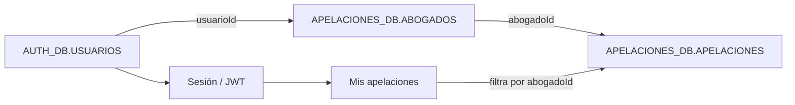

# Plan de vinculación de usuarios y abogados — Módulo de Apelaciones

## 1. Objetivo

Vincular cada registro operativo de abogado del módulo de Apelaciones con una cuenta de usuario del sistema, de forma que el abogado autenticado pueda acceder posteriormente a una bandeja personalizada con sus expedientes asignados.

La vinculación no modificará el algoritmo de la nueva modalidad de asignación. Su finalidad será identificar de manera segura qué usuario representa a cada abogado.

## 2. Alcance

Este plan comprende:

- Relación uno a uno entre usuario y abogado.
- Gestión administrativa del vínculo.
- Permiso de módulo `apelaciones` con rol `abogado`.
- Identificación del abogado a partir de la sesión/JWT.
- Protección backend de los expedientes asignados.
- Base técnica para una futura interfaz **Mis apelaciones**.
- Auditoría, pruebas, migración Oracle y despliegue Docker.

No comprende inicialmente:

- Rediseño completo del dashboard de Apelaciones.
- Modificación de la regla de asignación automática.
- Migración de usuarios desde sistemas externos.
- Eliminación de abogados o expedientes históricos.

## 3. Principio de diseño

`Usuario` y `Abogado` representan conceptos diferentes:

- **Usuario:** identidad de acceso, correo, contraseña, estado y permisos.
- **Abogado:** entidad operativa que recibe apelaciones y acumula carga.

La relación recomendada es uno a uno:



No se vincularán registros por coincidencia de nombre o correo. Se utilizarán exclusivamente los identificadores internos.

## 4. Modelo de datos propuesto

### 4.1. Tabla `ABOGADOS`

Agregar en Oracle:

```sql
ALTER TABLE APELACIONES_DB.ABOGADOS
ADD usuarioid VARCHAR2(36 CHAR) NULL;

ALTER TABLE APELACIONES_DB.ABOGADOS
ADD CONSTRAINT uq_abogados_usuarioid UNIQUE (usuarioid);
```

`usuarioid` será inicialmente nullable para permitir abogados históricos o pendientes de vinculación.

### 4.2. Integridad entre microservicios

`AUTH_DB.USUARIOS` pertenece al servicio de autenticación y `APELACIONES_DB.ABOGADOS` al servicio de Apelaciones. Se recomienda:

- Guardar `usuarioId` como referencia externa única en `ABOGADOS`.
- Validar la existencia y estado del usuario mediante la API del servicio de autenticación.
- No crear una dependencia directa de SQLAlchemy entre ambos servicios.
- Evaluar una llave foránea entre esquemas Oracle únicamente si la política de base de datos y los permisos institucionales lo permiten.

## 5. Reglas de negocio

1. Un usuario puede estar vinculado como máximo con un abogado.
2. Un abogado puede tener como máximo un usuario vinculado.
3. El usuario debe estar activo al momento de vincularse.
4. El usuario debe tener acceso al módulo `apelaciones` con rol de módulo `abogado`.
5. Un usuario administrador, director o registrador no se vinculará como abogado salvo autorización expresa.
6. Desactivar al usuario impedirá iniciar sesión, pero no alterará expedientes ni historial.
7. Desactivar al abogado impedirá nuevas asignaciones, pero no eliminará su cuenta ni sus expedientes.
8. Desvincular no eliminará al usuario ni al abogado.
9. No se podrá eliminar físicamente un abogado con apelaciones relacionadas.
10. Toda vinculación, cambio y desvinculación quedará registrada en auditoría.
11. La vinculación no cambiará los totales ni el turno de la nueva modalidad.

## 6. Plan de implementación paso a paso

### Fase 0 — Confirmación funcional

1. Confirmar los abogados que recibirán cuenta inicialmente.
2. Confirmar que el rol se denominará `abogado` dentro del módulo `apelaciones`.
3. Definir quiénes podrán crear y vincular cuentas: recomendado `admin` y dirección/coordinación autorizada.
4. Definir si un abogado inactivo conservará acceso de solo lectura o perderá acceso al módulo.
5. Aprobar los estados visibles: `Sin usuario`, `Vinculado`, `Usuario inactivo` y `Vínculo inconsistente`.

**Criterio de salida:** reglas funcionales aprobadas antes de modificar Oracle.

### Fase 1 — Migración Oracle

1. Crear un script versionado de migración para agregar `usuarioid` a `ABOGADOS`.
2. Crear la restricción única sobre `usuarioid`.
3. Verificar que la migración no modifique registros existentes.
4. Crear un script de reversión que elimine primero la restricción y después la columna.
5. Ejecutar la migración en desarrollo.
6. Verificar estructura y restricciones directamente en Oracle `XEPDB1`.

**Criterios de aceptación:**

- Oracle acepta abogados sin usuario vinculado.
- Oracle rechaza el mismo `usuarioId` en dos abogados.
- No se crea ni utiliza SQLite como respaldo.

### Fase 2 — Backend de autenticación

1. Reconocer `abogado` como rol válido del módulo `apelaciones`.
2. Mantener el rol general como `usuario`.
3. Incorporar o reutilizar un endpoint interno para consultar usuarios elegibles.
4. Permitir búsqueda administrativa por nombre o correo.
5. Excluir usuarios inactivos o ya vinculados, según información recibida desde Apelaciones.
6. Verificar que el JWT continúe incluyendo `usuarioId`, rol general y permisos por módulo.

Ejemplo de permiso:

```json
{
  "modulo": "apelaciones",
  "rolModulo": "abogado"
}
```

**Criterio de aceptación:** un usuario con este permiso puede autenticarse y ser reconocido como abogado del módulo, pero todavía no accede a expedientes hasta completar el vínculo.

### Fase 3 — Backend de Apelaciones

1. Agregar `usuarioId` al modelo SQLAlchemy `AbogadoModel`.
2. Agregar `usuarioId` a las entidades y esquemas Pydantic de abogado.
3. Exponer el estado de vinculación al listar abogados.
4. Implementar vinculación y desvinculación con validación administrativa.
5. Antes de vincular, consultar el servicio de autenticación para verificar:
   - que el usuario existe;
   - que está activo;
   - que tiene módulo `apelaciones`;
   - que posee rol de módulo `abogado`.
6. Comprobar que el usuario no esté vinculado a otro abogado.
7. Implementar un endpoint que resuelva el abogado autenticado.

Endpoints sugeridos:

```http
GET    /api/abogados
PUT    /api/abogados/{abogadoId}/usuario
DELETE /api/abogados/{abogadoId}/usuario
GET    /api/abogados/me
```

Ejemplo de vinculación:

```json
{
  "usuarioId": "uuid-del-usuario"
}
```

8. Registrar en auditoría usuario ejecutor, abogado, usuario vinculado, fecha y valores anterior/nuevo.
9. Manejar explícitamente errores del servicio de autenticación; nunca guardar un vínculo sin validar.

**Criterio de aceptación:** `GET /api/abogados/me` devuelve el abogado asociado al `usuarioId` del JWT, sin aceptar un ID enviado por el navegador.

### Fase 4 — Interfaz de Gestión de Abogados

1. Añadir a cada fila una sección **Cuenta de acceso**.
2. Mostrar uno de estos estados:
   - `Sin usuario` — ámbar.
   - `Vinculado` — verde.
   - `Usuario inactivo` — rojo.
   - `Abogado inactivo` — gris.
3. Incorporar las acciones:
   - `Vincular usuario`.
   - `Crear usuario`.
   - `Cambiar vínculo`.
   - `Desvincular`.
4. Crear un modal de búsqueda de usuarios elegibles.
5. Mostrar nombre, correo, dirección, estado y rol del usuario antes de confirmar.
6. Solicitar confirmación para cambiar o desvincular una cuenta.
7. Evitar que la edición del nombre del abogado cambie o rompa la relación.
8. Mostrar errores de validación provenientes del backend.

**Criterio de aceptación:** el administrador puede identificar visualmente cuáles abogados tienen acceso y vincular una cuenta sin copiar IDs manualmente.

### Fase 5 — Creación de usuario desde Gestión de Abogados

Esta fase puede realizarse después de que la vinculación de usuarios existentes esté estable.

1. Abrir un formulario con el nombre del abogado precargado.
2. Solicitar correo institucional y contraseña temporal o mecanismo de activación.
3. Crear la cuenta en el servicio de autenticación con:
   - rol general `usuario`;
   - módulo `apelaciones`;
   - rol de módulo `abogado`.
4. Vincular el usuario creado al abogado.
5. Si la vinculación falla después de crear la cuenta, informar claramente que quedó una cuenta sin vincular y permitir reintentar.
6. No almacenar contraseñas ni hashes en el servicio de Apelaciones.

**Decisión técnica:** al tratarse de dos microservicios, la operación no será una única transacción Oracle. Se utilizará una secuencia controlada con reintento y compensación.

### Fase 6 — Autorización por expediente

1. Crear una función backend que resuelva `usuarioId → abogadoId`.
2. Aplicar el filtro de propiedad en consultas de expedientes para el rol `abogado`.
3. Impedir que un abogado consulte un expediente ajeno cambiando manualmente la URL.
4. Impedir que modifique o descargue documentos de expedientes ajenos.
5. Mantener acceso global para administradores y perfiles directivos autorizados.
6. Definir explícitamente qué acciones puede realizar el abogado sobre sus casos.
7. Registrar accesos y modificaciones relevantes en auditoría.

**Regla esencial:** la seguridad se aplicará en el backend. El filtro visual del frontend no será considerado un control de acceso.

### Fase 7 — Bandeja “Mis apelaciones”

1. Crear la ruta sugerida `/apelaciones/mis-apelaciones`.
2. Consultar los expedientes usando el abogado resuelto desde el JWT.
3. Mostrar indicadores:
   - pendientes;
   - en trámite;
   - próximos a vencer;
   - vencidos;
   - atendidos o concluidos.
4. Añadir búsqueda por expediente y apelante.
5. Añadir filtros por estado, complejidad, fecha y plazo.
6. Permitir abrir el detalle únicamente si pertenece al abogado autenticado.
7. Mostrar las acciones autorizadas: observaciones, actuaciones, documentos y cambio de estado, según definición funcional.
8. Incorporar estados vacíos, errores y carga progresiva.

**Criterio de aceptación:** Karla, Karol y Clara ven exclusivamente sus propios expedientes al iniciar sesión con sus respectivas cuentas.

### Fase 8 — Pruebas

#### Backend

1. Vinculación correcta.
2. Rechazo de usuario inexistente.
3. Rechazo de usuario inactivo.
4. Rechazo de usuario sin rol `abogado` en Apelaciones.
5. Rechazo de usuario ya vinculado.
6. Desvinculación sin pérdida de expedientes.
7. Resolución correcta de `/api/abogados/me`.
8. Acceso autorizado a expediente propio.
9. Respuesta `403` para expediente de otro abogado.
10. Conservación del historial al desactivar usuario o abogado.

#### Frontend

1. Estados visuales de vínculo.
2. Búsqueda y selección de usuario.
3. Confirmaciones de cambio y desvinculación.
4. Mensajes ante indisponibilidad de autenticación.
5. Bandeja individual y filtros.
6. Acceso directo por URL a expediente ajeno.
7. Ausencia de errores de consola y advertencias React.
8. Validación obligatoria con `npx tsc --noEmit` y resultado de cero errores.

#### Integración

1. Login del abogado.
2. Resolución de identidad entre servicios.
3. Consulta de expedientes propios.
4. Auditoría completa de vínculo y acciones.
5. Verificación HTTP 200 en las rutas permitidas y 401/403 donde corresponda.

### Fase 9 — Migración de datos inicial

1. Crear o identificar las cuentas institucionales de los abogados actuales.
2. Confirmar manualmente cada correspondencia.
3. Vincular por ID, nunca mediante una actualización masiva por nombre.
4. Preparar un reporte antes/después:
   - abogado;
   - `abogadoId`;
   - usuario;
   - `usuarioId`;
   - estado;
   - fecha de vinculación.
5. Revisar especialmente Karla García, Karol Castro y Clara Michaud por su participación en la nueva modalidad.

### Fase 10 — Despliegue y verificación

1. Respaldar las tablas Oracle afectadas.
2. Aplicar primero la migración de base de datos.
3. Desplegar el servicio de autenticación si requiere cambios.
4. Desplegar el servicio de Apelaciones.
5. Desplegar el frontend.
6. Si Docker recrea el gateway, reiniciar el balanceador Nginx para actualizar la resolución interna.
7. Ejecutar pruebas de humo con un administrador y un abogado.
8. Confirmar que la nueva asignación automática continúa funcionando sin variaciones.
9. Monitorear errores 401, 403, 409 y 5xx.

## 7. Orden recomendado de entregas

### Entrega 1 — Vinculación administrativa

- Migración Oracle.
- Campo `usuarioId` en abogados.
- APIs de vinculación/desvinculación.
- Estado y botón de vinculación en Gestión de Abogados.
- Auditoría.

### Entrega 2 — Identidad y seguridad del abogado

- Rol de módulo `abogado`.
- Endpoint `/api/abogados/me`.
- Autorización backend por expediente.
- Pruebas de acceso propio/ajeno.

### Entrega 3 — Experiencia del abogado

- Bandeja **Mis apelaciones**.
- Indicadores, alertas y filtros.
- Acciones sobre expedientes asignados.
- Pruebas E2E completas.

Este orden reduce el riesgo: primero se establece la identidad, después se protege el acceso y finalmente se construye la experiencia personalizada.

## 8. Riesgos y mitigaciones

| Riesgo | Mitigación |
|---|---|
| Vincular al usuario equivocado | Confirmación con nombre y correo; auditoría; cambio reversible |
| Duplicar la vinculación | Restricción única Oracle y validación backend |
| Acceso a expedientes ajenos | Autorización backend basada en JWT y `abogadoId` resuelto |
| Servicio de autenticación no disponible | Bloquear la vinculación y permitir reintento; no guardar referencias sin validar |
| Usuario creado pero no vinculado | Estado recuperable y acción de reintento |
| Desactivar abogado y usuario como si fueran lo mismo | Estados separados y reglas explícitas |
| Alterar la nueva modalidad | No usar `usuarioId` en el algoritmo; mantener asignación por `abogadoId` |
| Caída tras recrear Docker | Desplegar por servicio y verificar/reiniciar Nginx cuando cambie el gateway |

## 9. Reversión

En caso de problemas:

1. Deshabilitar temporalmente las acciones de vinculación en frontend.
2. Mantener `usuarioId` nullable; los abogados seguirán funcionando operativamente sin cuenta asociada.
3. Revertir los servicios de frontend y backend a sus imágenes anteriores.
4. No eliminar vínculos durante una reversión de aplicación salvo que se haya comprobado corrupción.
5. Si se revierte completamente la funcionalidad, respaldar los vínculos, eliminar la restricción única y luego eliminar la columna mediante el script de rollback.

La asignación existente continuará usando `abogadoId`, por lo que una reversión de la vinculación no debe modificar expedientes ni distribución.

## 10. Definición de terminado

La iniciativa estará completa cuando:

- Cada abogado objetivo tenga una cuenta vinculada de forma única.
- El usuario pueda iniciar sesión con rol de módulo `abogado`.
- El backend resuelva al abogado desde el JWT.
- El abogado vea únicamente sus expedientes.
- Un intento de acceder a un expediente ajeno sea rechazado.
- Las vinculaciones y acciones queden auditadas.
- La nueva modalidad de asignación conserve su comportamiento actual.
- Las pruebas backend, integración y E2E sean satisfactorias.
- `npx tsc --noEmit` finalice con cero errores.
- Los servicios desplegados respondan correctamente en Docker.

