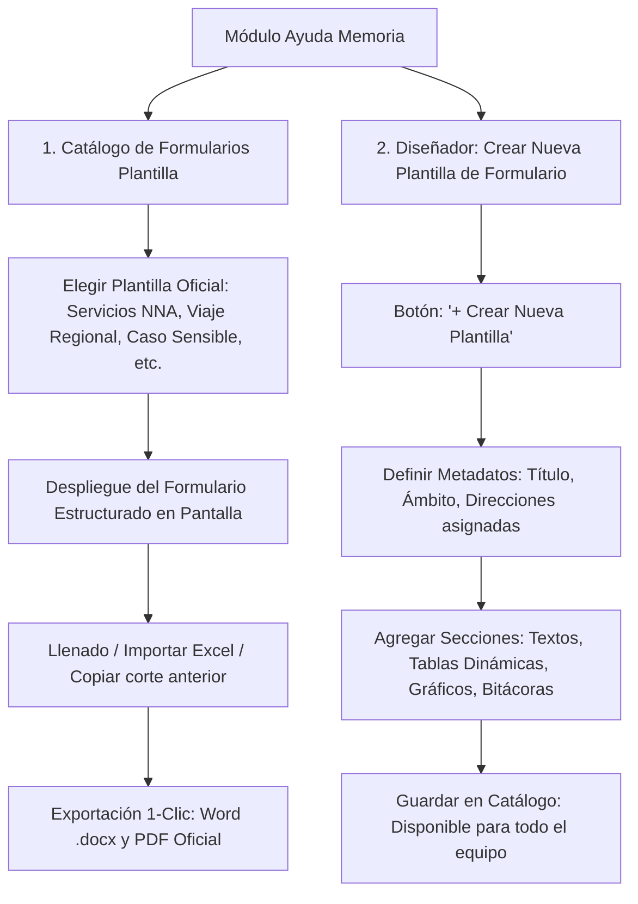

# Módulo de Ayuda Memoria — Análisis, Diseño y Especificación Técnica

## 1. Objetivo

Automatizar y descentralizar la generación de reportes ejecutivos (*Ayudas Memoria*) requeridos por la Alta Dirección del MIMP (Despacho Ministerial, Viceministerio de Poblaciones Vulnerables, Dirección General).

El sistema sustituye la dependencia de archivos dispersos en repositorios personales, transformando el proceso en una **plataforma dinámica basada en Formularios Plantilla**:
1. Permite seleccionar plantillas oficiales preconfiguradas o **diseñar y crear nuevas plantillas de formulario** según las necesidades cambiantes del Despacho.
2. Cada Dirección de Línea (DPE, DA, DSLD, DPNNA) completa sus datos de primera mano en formularios estructurados y ergonómicos.
3. El sistema compila y exporta con un solo clic documentos oficiales en **Word (.docx) y PDF**, integrando textos ejecutivos, tablas matriciales y gráficos estadísticos en alta resolución.

---

## 2. Diagnóstico: Análisis de los Documentos Reales de la Carpeta `AM`

Del análisis de los 22 archivos reales obrantes en la carpeta `AM` (Word, Excel y PDF de Madre de Dios, Piura, Línea 1810, Caso BB Milagros, Matrices UPE, etc.), se desprenden 4 requerimientos estructurales:

1. **Formatos Regionales de Comisiones y Viajes de Despacho:**
   - Para viajes oficiales (ej. *Piura, Madre de Dios, Ayacucho, Pasco, Condorcanqui*), se solicita un consolidado exclusivo de la región visitada.
   - Demanda cruzar información de todas las direcciones: directorio de CARs locales (con directores y teléfonos), DEMUNAs acreditadas por provincia y distrito, y atenciones locales de UPE y Línea 1810.
2. **Tablas Estadísticas Complejas y Series Temporales:**
   - Expedientes como `AM_LINEA ANNA 1810` o matrices como `AMBITO DE COMPETENCIA 26 UPE.xlsx` contienen evoluciones mensuales (enero a diciembre) y series históricas (2019-2026). Al pegarse manualmente en Word sufren descuadres de formato.
3. **Casos Mediáticos / Sensibles (Marco D.L. 1297):**
   - Expedientes como `BB MILAGROS` o `Caso Adolescente Apurímac` requieren fichas inmutables del hecho y una bitácora cronológica rigurosa de actuaciones interinstitucionales que no admite sobrescritura.
4. **Demanda Dinámica de Nuevos Formatos e Indicadores:**
   - El archivo `FALTAN EN LA AYUDA MEMORIA.docx` demuestra que con frecuencia surgen nuevas exigencias de información que no encajan en un único formato rígido.

---

## 3. Sistema de Formularios Plantilla (Predefinidos y Creador a Medida)

El módulo opera como un **motor de formularios plantilla interactivos**, permitiendo tanto el uso inmediato de modelos oficiales como la creación de nuevos formatos sin necesidad de programar código.



### A. Catálogo de Formularios Plantilla Prediseñados (Listos para Usar)

El sistema incluye de fábrica 4 formularios plantilla estándar:

1. 📋 **Plantilla: Servicios NNA (Nacional):**
   - Estructurada en bloques modulares: CAR, Acreditación CAR, UPE, Familias Acogedoras, Adopciones, DEMUNAs, Juguemos, CCONNA, COMUDENNA, Línea 1810, Campañas.
   - Datos conceptuales fijos, cifras del corte temporal nacional y cuadros comparativos.
2. 🗺️ **Plantilla: Ayuda Memoria Regional (Viajes de Despacho):**
   - Vinculada al selector de departamento (ej. *Piura*, *Madre de Dios*).
   - Despliega automáticamente los cuadros y cifras de esa circunscripción: lista de CARs con estado de acreditación, DEMUNAs acreditadas desglosadas por provincia y distrito, y atenciones locales.
3. 🚨 **Plantilla: Estado Situacional de Caso Sensible / Mediático:**
   - Ficha fija: Datos del hecho, NNA en protección, servicio MIMP vinculado, nivel de riesgo.
   - Bitácora cronológica acumulativa (*append-only*): Registro secuencial de actuaciones con fecha, hora y autor.
4. 📢 **Plantilla: Hito / Intervención Temática Especial:**
   - Diseñada para reportar eventos, asambleas o estrategias puntuales (ej. *Asamblea Nacional CCONNA*, *Operativos de Trata / Violencia Digital*, *Estrategia Sonríe*).

---

### B. Diseñador / Creador de Nuevas Plantillas de Formulario (`+ Crear Nueva Plantilla`)

Permite al Administrador (Cristian) crear formatos de formulario personalizados para cualquier requerimiento imprevisto:

1. **Definición de Propiedades del Formulario:**
   - **Nombre de la plantilla:** (ej. *"Formato de Supervisión Inopinada de CAR"*, *"Informe de Alerta Temprana"*).
   - **Ámbito territorial:** Nacional, Regional o Por Servicio Específico.
   - **Direcciones participantes:** Selección de qué direcciones de línea completan el formulario (DPE, DA, DSLD, DPNNA o Multidireccional).
2. **Constructor Visual de Bloques y Componentes:**
   El Administrador compone el formulario agregando bloques modulares:
   - `[+ Bloque de Texto Descriptivo]`: Con título y guía de llenado para el especialista.
   - `[+ Bloque de Cuadro / Tabla Dinámica]`: Permite definir las columnas de la tabla (ej. *Provincia, Distrito, Entidad, Teléfono, Estado*).
   - `[+ Bloque de Gráfico Estadístico]`: Configura el tipo de visualización (barras temporales, dona de porcentajes, barras por región).
   - `[+ Bloque de Bitácora Cronológica]`: Para seguimiento de hitos secuenciales fecha por fecha.
   - `[+ Bloque de Conclusiones / Acuerdos]`: Puntos clave ejecutivos.
3. **Publicación y Disponibilidad:**
   - Una vez guardada, la nueva plantilla queda incorporada al catálogo general y accesible para los especialistas asignados.

---

## 4. Arquitectura de Navegación por Direcciones de Línea

La interfaz se organiza con acceso desde el menú general (`/menu`) hacia `/ayuda-memoria`:

```
┌─────────────────────────────────────────────────────────────────────────────┐
│ 📑 MÓDULO AYUDA MEMORIA — DGNNA                                             │
├─────────────────────────────────────────────────────────────────────────────┤
│ 🏢 DPE        — Dirección de Protección Especial                            │
│ ⚖️ DA         — Dirección de Adopciones                                     │
│ 🏛️ DSLD       — Dirección de Sistemas Locales y Defensorías                  │
│ 📢 DPNNA      — Dirección de Políticas de Niñas, Niños y Adolescentes       │
│ 🤝 COLABORATIVO — Plantillas compartidas y casos vinculados                  │
├─────────────────────────────────────────────────────────────────────────────┤
│ 👑 CONSOLIDADO EJECUTIVO (Administrador / Alta Dirección)                   │
│    • Galería de Formularios Plantilla y Botón '+ Crear Nueva Plantilla'     │
│    • Tablero de Control de Avance y Semáforos por Dirección                 │
│    • Constructor y Compilador Modular de Informes (Word / PDF)              │
│    • Registro de Auditoría de Accesos                                       │
└─────────────────────────────────────────────────────────────────────────────┘
```

### Operación por Dirección de Línea

Al ingresar a una Dirección (ej. **DPE**):
- El especialista visualiza únicamente los formularios y registros que le competen:
  - En **DPE**: Formularios de CAR, Acreditación, UPE, Familias Acogedoras y casos asignados.
  - En **DA**: Formularios de Adopciones y casos vinculados.
  - En **DSLD**: Formularios de DEMUNAs y Estrategia Juguemos.
  - En **DPNNA**: Formularios de CCONNA, COMUDENNA, Línea 1810 y Campañas.
- Funciones ergonómicas: Botón **"Copiar corte anterior"** para no tipear lo que no ha cambiado, autoguardado en segundo plano y botón de sellado oficial.

---

## 5. Dinamismo: Cuadros Estructurados y Gráficos Estadísticos

Para dar respuesta a los requerimientos técnicos evidenciados en la carpeta `AM`:

### A. Motor de Cuadros Dinámicos (DataGrid Interactivo)
- **Edición en celdas tipo hoja de cálculo:** Agregar, modificar y ordenar filas directamente en pantalla.
- **Importación desde Excel:** Botón para cargar archivos `.xlsx` y poblar automáticamente tablas masivas (como directorios o coberturas).
- **Cálculo automático:** Sumatorias y porcentajes calculados por el sistema, garantizando coherencia matemática en el reporte.

### B. Motor de Gráficos Estadísticos (Web + Inyección en Word)
- **Visualización interactiva en plataforma:** Gráficos reactivos mediante Recharts (evolución mensual de llamadas, barras anuales de atenciones, porcentajes de acreditación).
- **Inyección automática en Word:** El backend genera la imagen en alta resolución (PNG a 300 DPI) y la incrusta de forma alineada en el documento `.docx`, acompañada de su pie de fuente oficial (*"Fuente: DGNNA - MIMP, Corte [Mes/Año]"*).

---

## 6. Selector de Ámbito: Modo "Viaje Regional" (1-Clic)

En la cabecera del módulo, el conmutador de alcance:
`[ Ámbito: Nacional ▾ ]` o selección por región `[ Piura ]`, `[ Madre de Dios ]`, `[ Pasco ]`, etc.

- Al seleccionar una región, el sistema **filtra de inmediato todos los bloques y tablas de todas las direcciones de línea** correspondientes a ese ámbito territorial.
- Con 1 clic en **"Generar Ayuda Memoria Regional"**, compila el informe Word exacto requerido para la comitiva de viaje, sin transcripciones manuales.

---

## 7. Modelo de Datos para Formularios Plantilla (SQLAlchemy / Oracle)

```
AM_PLANTILLA_FORMULARIO   (Definición de plantillas)
- plantilla_id PK
- codigo_clave            (SERV_NNA | REGIONAL | CASO_SENSIBLE | HITO_TEMATICO | PERSONALIZADO)
- nombre
- descripcion
- tipo_ambito             (NACIONAL | REGIONAL | ESPECIFICO)
- es_oficial              (BOOLEAN: true para estándar, false para creadas por usuario)
- direccion_dueña         (DPE | DA | DSLD | DPNNA | MULTIDIRECCIONAL)
- activo                  (BOOLEAN)
- creado_por_usuario_id FK

AM_PLANTILLA_SECCION      (Bloques que componen una plantilla)
- seccion_id PK
- plantilla_id FK
- tipo_seccion            (TEXTO_DESCRIPTIVO | CUADRO_DATOS | GRAFICO | BITACORA | CONCLUSIONES)
- titulo_seccion
- guia_llenado
- configuracion_json      (columnas de tabla, tipo de gráfico, etc.)
- orden                   (INTEGER)

AM_REGISTRO_DOCUMENTO     (Una ayuda memoria generada a partir de una plantilla)
- documento_id PK
- plantilla_id FK
- codigo_interno          (ej. AM-2026-0089 o CS-2026-0045)
- titulo_visible
- fecha_corte             (DATE)
- region_codigo           (VARCHAR nullable: ej. 'PIU', 'MDD')
- estado                  (BORRADOR | PUBLICADO | HISTORICO)
- fecha_creacion
- creado_por_usuario_id FK

AM_DOCUMENTO_SECCION_VALOR (Respuestas y contenido llenado por sección)
- valor_id PK
- documento_id FK
- seccion_id FK
- texto_contenido         (CLOB / TEXT)
- datos_cuadro_json       (JSON con las filas y celdas de las tablas)
- configuracion_grafico   (JSON con series numéricas)
- fecha_actualizacion
- actualizado_por_usuario_id FK

AM_CASO_ACCION            (Bitácora histórica: SOLO CRECE)
- accion_id PK
- documento_id FK
- fecha_hora
- descripcion_accion
- autor_usuario_id FK
- institucion_involucrada

AM_AUDITORIA_ACCESO       (Trazabilidad legal D.L. 1297)
- acceso_id PK
- documento_id FK
- usuario_id FK
- accion                  (VER | EXPORTAR_DOCX | EXPORTAR_PDF)
- fecha_hora
```

---

## 8. Reglas de Negocio Clave

1. **Formularios Dinámicos Extensibles:** La creación de nuevas plantillas de formulario no requiere modificaciones de código ni migraciones de base de datos gracias al modelo seccional flexible.
2. **Inmutabilidad Documental:** Al publicar una ayuda memoria, se sella la versión oficial generando un registro histórico inmutable; cualquier modificación posterior produce una nueva versión numerada.
3. **Regla de Solo Acumulación (Append-Only):** Las bitácoras cronológicas de casos sensibles nunca permiten edición o supresión de entradas previas.
4. **Reserva de Identidad y Auditoría:** Toda lectura o descarga de información sensible de NNA queda auditada en cumplimiento de la normativa de protección de la niñez (D.L. 1297).
5. **Alineación de Estilo Institucional:** Todo documento exportado en Word respeta automáticamente márgenes, logotipos vigentes, paleta cromática y tipografías normadas del MIMP.
